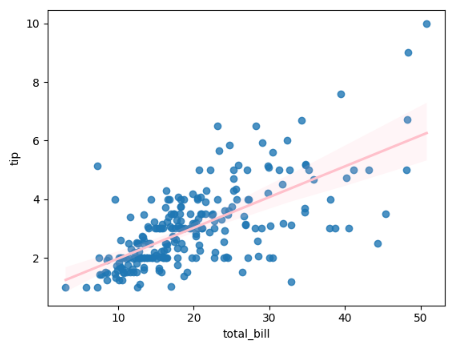

# 목차

1. 선형회귀: 입력과 출력의 선형 관계를 찾는 방법
2. 단순선형회귀: 하나의 입력 변수로 출력 예측하기
3. 다중선형회귀: 여러 입력 변수를 활용한 예측
4. 선형회귀 주의사항: 변수 상관(다중공선성), 상관과 인과 구분

# 학습 목표

- 선형회귀의 핵심 개념 이해: 입력-출력의 선형 관계, 단순선형회귀 이해
- 모델 적합: 잔차제곱합(RSS)과 최소 제공 이해
- 다중선형회귀로 확장한 학습 방법 이해

# 1. 선형회귀

## 1-1. 선형회귀(Linear Regression)

- 입력 변수와 출력 변수 사이의 관계를 직선 형태로 표현한 것
- 과거의 관계를 기반으로 새로운 데이터를 예측하기 위해 사용하는 모델링 방법 중 하나
- 지도학습의 가장 기초가 되는 접근 중 하나

# 2. 단순선형회귀(Simple Linear Regression)

- 한 개의 설명변수(x)와 하나의 반응변수(y) 사이의 선형(직선) 관계를 찾는 방법

예시

- 설명변수 x: 전체 음식 값
- 반응변수 y: 팁 금액

예시 이미지

➡️ 해당 그래프의 핑크색 선은 '전체 음식 값' 과 '팁 금액' 간의 관계를 가장 잘 표현할 수 있는 모델, 즉 식이다.

단일 설명변수를 이용한 단순선형회귀는 다음 식을 나타낼 수 있다.

## 2-1. 모델

$$
Y = \beta_0(y 절편) + \beta_1(기울기)X + ε(관측 오차)
$$

- `y절편`: x = 0 일 때 y 값. 예제에서는 식당에서 지불한 비용이 0원일 때 내는 팁의 값
- `기울기`: x 가 1단위 증가할 때 y 의 평균 증가량

## 2-2. 최소 제곱법(least squares)

각 데이터들의 관계를 표현하는 모델이라면, 오차를 가장 적게 내는 직선을 찾는 것이 관건이다. 그 방법으로는 최소제곱법이 있다.

- 실제 관측값과 예측값의 차이를 제곱해 합한 값(RSS, 잔차제곱합)을 최소화하는 법

### 잔차(residual) 정의

$$
e_i = y_i - y\hat{}_i(예측 값)
$$

### 예측 값

$$
y\hat{}_i = \beta\hat{}_0 + \beta\hat{}_1x_i
$$

### RSS(잔차제곱합) 정의

$$
RSS = e_1^2 + e_2^2 + ... + e_n^2
$$

### =

$$
RSS = \displaystyle\sum_{i=1}^{n}{ e_i^2} = \displaystyle\sum_{i=1}^{n}{(y_i - y\hat{}_i)^2} = \displaystyle\sum_{i=1}^{n}{(y_i - \beta\hat{}_0 + \beta\hat{}_1x_i)^2}
$$

### 계수를 측정하기 위한 공식: closed-form solution

$$
\beta_1\hat{} = \frac{\displaystyle\sum_{i=1}^{n}(x_i - \bar{x})(y_i - \bar{y})}{\displaystyle\sum_{i=1}^{n}{(x_i - \bar{x}})^2}
$$

**절편**

$$
\beta_0\hat{} = \bar{y} - \beta_1\hat{}\bar{x}
$$

- RSS 를 최소화하는 절편 $\beta_0\hat{}$ 을 찾기 위해 미분(기울기)이 0이 되는 지점을 구함
- 회귀식 자체는 1차식이고, 잔차도 1차식이다. 따라서 잔차를 제곱한 함수는 2차함수가 되고, 일반적으로 아래로 볼록한 포물선 형태를 가진다. 따라서 기울기가 0인 지점이 함수의 최솟값이 되고, 곧 오차의 최솟값을 가진다.

- $\bar{x}$: x들의 평균값
- $\bar{y}$: y들의 평균값

> 나중에 경사하강법에서 선형회귀 푸는 방법을 다룰 예정

# 3. 다중선형회귀(multiple linear regression)

## 3-1 다중선형회귀란?

### 단순선형회귀 vs 다중선형회귀

| 구분              | 단순선형회귀        | 다중선형회귀                          |
| ----------------- | ------------------- | ------------------------------------- |
| **독립변수 개수** | 1개                 | 2개 이상                              |
| **모델 형태**     | 𝑦 = 𝑎 + 𝑏x          | 𝑦 = 𝑎 + 𝑏₁x₁ + 𝑏₂x₂ + ... + 𝑏ₙxₙ + ε  |
| **목적**          | 한 변수의 영향 분석 | 여러 변수의 복합적 영향 분석          |
| **시각화**        | 2차원 직선 그래프   | 고차원 평면 (시각화 어려움)           |
| **예시**          | 공부시간 → 시험점수 | 공부시간, 수면시간, 식습관 → 시험점수 |

- 단순 선형 회귀: 전체 음식값과 팁 비용만의 관계 고려
- 다중 선형 회귀: 전체 음식값, 점원의 친절도 등과 팁 비용간의 관계 고려

## 3-2 다중선형회귀의 추정과 예측

### 예측값

$$
\hat{y}_i = \hat{\beta}_0 + \hat{\beta}_1 x_{i1} + \hat{\beta}_2 x_{i2} + \cdots + \hat{\beta}_p x_{ip}
$$

### RSS

$$
\sum_{i=1}^{n}{ e_i^2} = \sum_{i=1}^{n}{(y_i - \hat{y}_i)^2} = \sum_{i=1}^{n}{(y_i - \hat{\beta}_0 - \hat{\beta}_1 x_{i1} - \hat{\beta}_2 x_{i2} - \cdots - \hat{\beta}_p x_{ip})^2}
$$

## 3-3 다중선형회귀 계수 추정 유도(행렬 표현)

### 행렬 표현

$$
\mathbf{y} =
\begin{aligned}[t]
& \begin{bmatrix} y_1 \\ y_2 \\ \vdots \\ y_n \end{bmatrix} \\
& = \begin{bmatrix} 1 & x_{11} & \cdots & x_{1p} \\ 1 & x_{21} & \cdots & x_{2p} \\ \vdots & \vdots & \ddots & \vdots \\ 1 & x_{n1} & \cdots & x_{np} \end{bmatrix} \begin{bmatrix} \beta_0 \\ \beta_1 \\ \vdots \\ \beta_p \end{bmatrix} + \begin{bmatrix} \epsilon_1 \\ \epsilon_2 \\ \vdots \\ \epsilon_n \end{bmatrix} \\
& = \mathbf{X}\boldsymbol{\beta} + \boldsymbol{\epsilon}
\end{aligned}
$$

### 해석

| 기호  | 의미                                               |
| ----- | -------------------------------------------------- |
| **y** | 실제 관측값 벡터 (n×1)                             |
| **X** | 입력 데이터 행렬 (n×(p+1)) — 맨 앞 열은 1 (절편용) |
| **β** | 회귀계수 벡터 ((p+1)×1)                            |
| **ε** | 오차 벡터 (n×1)                                    |

### 예시

- 공부시간이 많을 수록 시험 점수가 많이 오를까?

$$
\mathbf{X} =
\begin{bmatrix}
1 & 2 \\
1 & 4 \\
1 & 6
\end{bmatrix},
\quad
\boldsymbol{\beta} =
\begin{bmatrix}
3 \\
2
\end{bmatrix}
$$

$$
\mathbf{y} = \mathbf{X}\boldsymbol{\beta} = \begin{bmatrix} 1 & 2 \\ 1 & 4 \\ 1 & 6 \end{bmatrix} \begin{bmatrix} 3 \\ 2 \end{bmatrix} = \begin{bmatrix} 7 \\ 11 \\ 15 \end{bmatrix}
$$

| 아이 | 공부시간(x) | 시험점수(y) |
| ---- | ----------- | ----------- |
| 1번  | 2시간       | ?           |
| 2번  | 4시간       | ?           |
| 3번  | 6시간       | ?           |

|        벡터 이름        |                                  모양                                  | 뜻                                                                |
| :---------------------: | :--------------------------------------------------------------------: | :---------------------------------------------------------------- |
|  $\boldsymbol{\beta}$   |                 $\begin{bmatrix} 3 \\ 2 \end{bmatrix}$                 | ‘3’은 **기본 점수(절편)**, ‘2’는 **공부시간당 점수 증가(기울기)** |
| $\boldsymbol{\epsilon}$ | $\begin{bmatrix} \epsilon_1 \\ \epsilon_2 \\ \epsilon_3 \end{bmatrix}$ | **오차(실수)** — 실제 점수와 예측 점수의 차이                     |

$$y_i=3+2x_i​$$

### 최소제곱법 목적: RSS 최소화

$$
RSS = (y - X\hat{\beta})^T (y - X\hat{\beta})
= y^T y - \hat{\beta}^T X^T y - y^T X \hat{\beta} + \hat{\beta}^T X^T X \hat{\beta}
$$

$$
\frac{\partial RSS}{\partial \hat{\beta}} = -2 X^T y + 2 X^T X \hat{\beta} = 0
$$

> RSS가 가장 작아지는 계수를 찾기 위해, 함수의 기울기가 0인 지점을 찾는 과정

### 정규방정식 해

$$
\hat{\beta} =
\begin{bmatrix}
\hat{\beta}_0 \\
\hat{\beta}_1 \\
\vdots \\
\hat{\beta}_p
\end{bmatrix}
= (X^T X)^{-1} X^T y
$$

# 4. 선형회귀 주의사항

## 4-1. 검증/테스트셋 데이터를 활용한 성능 평가

> 선형회귀 결과 검증 및 테스트 성능

- 훈련 데이터에서의 성능

  - 회귀식을 만들 때 최소제곱 해는 훈련 데이터만 보고 계산됨
  - 학습에 사용된 훈련 데이터에서는 적합이 잘 되어 있을 것임.
  - 그러나 이것은 테스트 성능을 과소평가할 가능성이 높음

- 테스트 성능 평가 필요
  - 선형회귀도 변일반화 성능을 확인하려면 훈련에 사용되지 않은 새로운 데이터에 적용해봐야 함
  - 수가 많거나 고차항을 사용하면 과적합 문제 발생 가능성 존재
  - 검증/교차검증을 통해서 적절한 적합을 찾을 수 있음

## 4-2. 다중선형회귀시 회귀계수 해석의 주의점

- 이상적 상황: 변수들이 독립적일 때 계수 해석이 명확함

- 문제 상황: 변수들이 서로 연관되어 있다면 계수 추정이 불안정해지고 해석에 혼동이 발생할 수 있음

- 주의: 관찰 데이터의 상관관계로 인과관계를 주장해서는 안됨
