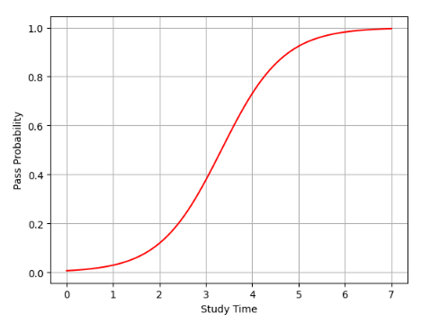

# 목차

1. 분류(Classification)

   1. 분류란?
   2. 예시: 신용카드 연체
   3. 분류 모델에서 선형 회귀의 한계

2. 로지스틱 회귀
   1. 로지스틱 회귀의 모형식
   2. MLE 활용 모수 추정
		1. 로지스틱 회귀의 우도 최대화
   3. 예시

   

# 학습 목표

- 분류 모델에서 로지스틱 회귀를 사용하는 이유를 이해
- 로지스틱 회귀 모형을 이해
- 신용카드 연체의 예시를 통해 분류 모델을 적용

# 1. 분류

## 1-1. 분류란?

- 정해진 카테고리 중 하나로 지정하는 것
- `범주형 변수`: 유일한 범주로 표현하는 변수

### 예시

|     변수 예시     |        범주         |
| :---------------: | :-----------------: |
|     **성별**      |  남성, 여성, 기타   |
|    **혈액형**     | A형, B형, O형, AB형 |
| **선호하는 색상** | 빨강, 파랑, 노랑 등 |
|   **거주 도시**   | 서울, 부산, 대구 등 |

- **분류함수의 목표**: 입력(ex. 성별을 알아차릴 수 있는 이미지, 스팸인지 구별하기 위한 이메일 내용 및 제목 등)을 특성 벡터로 받고, 주어진 카테고리 중 어떤 것과 매핑을 할 지 결정.
  - 분류함수 f(x)를 학습하여 입력 X 가 속할 카테고리 예측
  - 범주의 직접 예측보다 각 범주에 속할 확률 P를 추정하는 것이 더 유용할 때가 많음(ex. 현재 가지고 있는 메일이 스팸일 확률이 97%, 정상 메일일 확률이 3%임.)

## 1-2. 신용카드 연체(Default)

// 다른 예시 들기

## 1-3. 분류 문제에 선형회귀를 써도 될까?

- 선형 회귀는 예측 확률이 0보다 작거나 1보다 클 수 있어 확률로 쓰기 부적절함

## 1-4. 분류 문제에서 적합한 모델

### 로지스틱 회귀(Logistic Regression)

- 시그모이드 함수를 활용해 0 - 1 범위 내 확률값 예측 보장

# 2. 로지스틱 회귀

## 2-1. 로지스틱 회귀의 모형식

- 이진 분류에서의 적절한 함수
  - 함수의 출력 범위가 모든 입력에 대해 0 - 1 사이의 범위를 가지는 함수

### 시그모이드 함수

$$
y = \frac{e^z}{1 + e^z} = \frac{1}{1 + e^{-z}}
$$

$$
(\text{오일러 수 } e \approx 2.71828)
$$

- `z`: input
- `y`: output

- 모든 실수 z 에 대한 y 값의 범위는 0 <= y <= 1 임
- z→∞ 이면 y 는 1로 수렴
- z→-∞ 이면 y 는 0 으로 수렴

### 로지스틱 회귀의 모형식

시그모이드 함수 $y = \frac{e^z}{1 + e^z}$ 의 z 에 선형회귀 식 $\beta_0 + \beta_1 x$ 식을 대입한 $$y = \frac{e^{\beta_0 + \beta_1 x}}{1 + e^{\beta_0 + \beta_1 x}}$$

- 확률표기 $p(x)$를 활용한다면 로지스틱 회귀의 모형식이 됨
$$
p(X) = P(Y = 1 \mid X)
$$ 로 두고,(x가 주어졌을 때, 결과 y 가 1일 확률)

$$
p(X; \boldsymbol{\beta}) = \frac{e^{\beta_0 + \beta_1 x}}{1 + e^{\beta_0 + \beta_1 x}} = \frac{1}{1 + e^{-(\beta_0 + \beta_1 x)}}
$$

$$
\boldsymbol{\beta} = [\beta_0, \beta_1]^{\text{T}}
$$

#### 개념
**오즈**: $\frac{성공확률}{실패확률}$

**로짓변환**: $log\frac{성공확률}{실패확률}$ = $\beta_0 + \beta_1$ x(선형식)

## 2-2. MLE 활용 모수 추정

- 로지스틱 회귀는 무엇을 기준으로 베타 값들을 추정해야할까?
- cf) 선형회귀는 RSS 를 기준으로 이를 최소화하는 베타값들을 찾는 것이 목표였음
- `우도(Likelihood)`: 현재 확률 함수가 데이터를 얼마나 잘 설명하는지를 나타낸 지표

> **비유 설명** \
A 주머니에서 빨간 공이 나올 확률이 30%, B 공에서 빨간 공이 나올 확률이 70% 라고 가정하자. \
우도는 내가 공 5개를 뽑았는데 빨간공이 훨씬 많을 때, B 주머니에서 뽑았을 확률이 더 높을 것이다 ! \
이처럼, 어떤 확률 설정이 관찰을 가장 잘 설명하는지에 대한 것임

- 이를 최대화 하는 것이 목표

### 2-2-1. 로지스틱 회귀의 우도 최대화

- 여러 관측치가 독립이라고 하면, 모든 관측치가 동시에 일어날 확률 = 각각의 확률의 곱
- ex. 동전 3번 던지기 -> H, H, T
- 로지스틱 회귀도 마찬가지로 각 데이터의 실제 y 값에 따라 확률을 곱해서 전체 데이터가 나올 가능성을 계산함

$$L(\beta) = \prod_{i} p_i^{y_i} (1 - p_i)^{1 - y_i}$$

하지만, 위와 같은 곱으로 이뤄진 함수의 경우 B 에 대해 미분이 어렵기 때문에 양 변에 log 를 취해 곱셈을 더하기로 변환시킨 뒤 log-likelihood 를 만들어 최대화함

$$\log L(\beta) = \sum_{i} [y_i \log p_i + (1 - y_i) \log (1 - p_i)]$$

- log 함수는 monotone 증가 함수라서 log-likelihood 로 변형하여 최대화하는 B 를 구해도 괜찮다 !

- $log L(\beta)$ 를 미분하여 도함수=0 에 근접하도록 수치적 최적화를 통해 B 들을 찾아나간다.

## 2-3. 예시

### 2-3-1. 상황 설정
- 문제: 이메일이 스팸인지 아닌지 분류
- `length`: 이메일의 길이
- `free_word`: `무료`라는 단어 등장 여부
- `y`: 결과. 스팸 = 1, 정상 = 0
- `B`: 학습 후 얻은 로지스틱 회귀 계수

| 특징        | β (계수) |
| --------- | ------ |
| Intercept | -3.0   |
| length    | 0.02   |
| free_word | 1.5    |

| 특징        | 해석                                                      |
| --------- | ------------------------------------------------------- |
| length    | 0.02 → 길이가 1 증가할 때 **스팸일 확률이 조금 증가**                    |
| free_word | 1.5 → “무료” 단어가 있으면 **스팸일 확률 크게 증가**                     |
| Intercept | -3.0 → 기준 상태 (length=0, free_word=0)에서 **스팸 확률이 매우 낮음** |

### 2-3-2. 로지스틱 회귀 식

$$\eta = \beta_0 + \beta_1 \cdot \text{length} + \beta_2 \cdot \text{free\_word}$$

$$p = \frac{1}{1 + e^{-\eta}}$$

### 2-3-3. 예측 예시

#### 관측치 1
- 이메일의 길이 = 100, free_word = 1

$$\eta = -3.0 + 0.02 \cdot 100 + 1.5 \cdot 1 = -3 + 2 + 1.5 = 0.5$$

$$p = \frac{1}{1 + e^{-0.5}} \approx 0.62$$

- 해석: 이 이메일이 스팸일 확률: 62% -> 스팸으로 분류 가능

