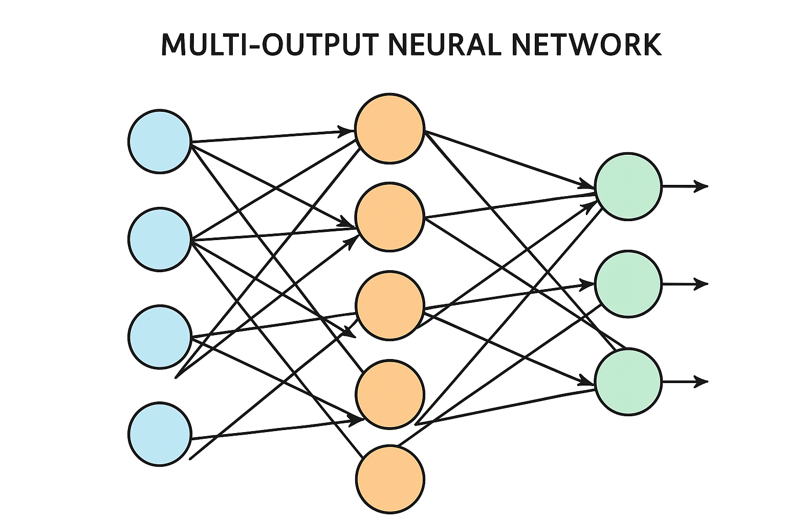
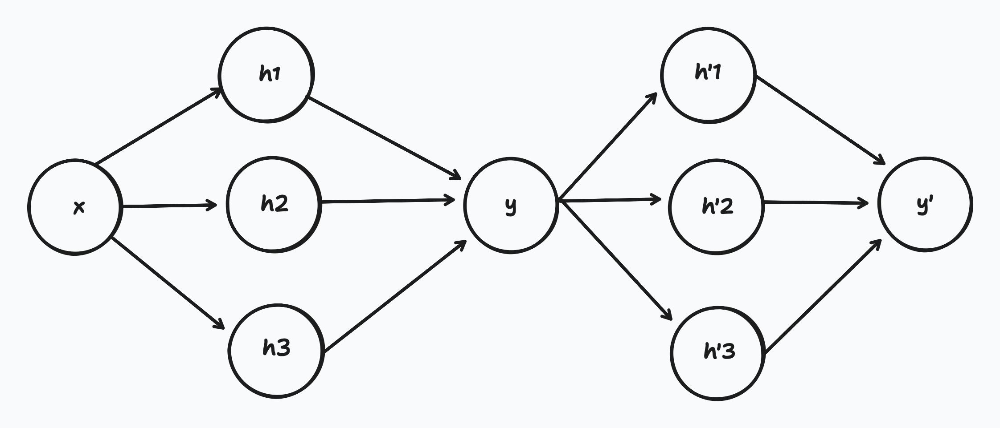
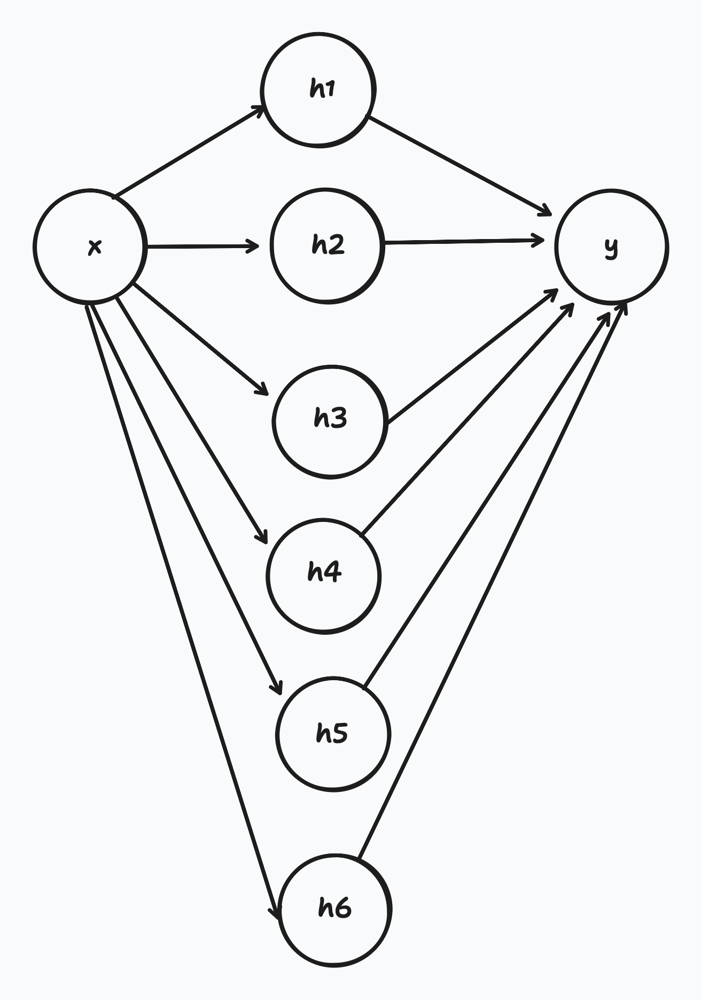
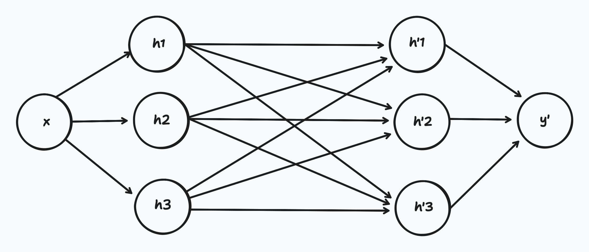

# 신경망 모델

## 목차

1. Shallow 네트워크
   1. 구조 및 활성화함수
   2. 조각별 선형(piecewise linear) 표현
   3. 표현력/보편적 근사 정리

2. Deep Network
   1. 네트워크 합성과 층별 출력
   2. Shallow vs Deep 비교
   3. 행렬·벡터 수식화와 도식

## 학습 목표

- 신경망이란 무엇인지 알아보고, 기본 구성요소를 설명한다.
- Hidden unit의 역할(비선형성 도입·특징 변환)을 이해한다.
- Shallow 네트워크와 Deep 네트워크의 차이(구조, 표현력, 효율성)를 구분한다.

---

# 1. Shallow 네트워크

## 1.1 선형 회귀부터 다시 보기

선형 회귀는 입력 하나에 대한 출력을 예측하는 가장 기본적인 모델임. 식으로 나타내면 다음과 같음.

$$y = \phi_0 + \phi_1 x$$

## 1.2 비선형 문제의 등장

"온도와 아이스크림 판매량"처럼 선형으로 표현할 수 있는 관계도 있지만, "시간과 행복도"처럼 복잡한 비선형 관계는 직선만으로 표현하기 어려움.

이를 해결하기 위해 **여러 개의 선을 꺾어서 부드럽게 연결하는 모델**이 필요함. 이것이 바로 **신경망(Neural Network)** 임.

## 1.3 Shallow 네트워크의 구조

Shallow 네트워크는 은닉층(hidden layer)이 **딱 한 층** 있는 모델임. 입력 값을 한 번 변환하여 더 다양한 형태의 출력을 만들어낼 수 있음.

식으로 나타내면 다음과 같음:

$$
y = \phi_0 + \phi_1 a[\theta_{10} + \theta_{11}x] + \phi_2 a[\theta_{20} + \theta_{21}x] + \phi_3 a[\theta_{30} + \theta_{31}x]
$$

## 1.4 활성화 함수(Activation Function)

신경망이 비선형 패턴을 학습하려면 **활성화 함수**가 필요함. 대표적인 활성화 함수로 ReLU(Rectified Linear Unit)가 있음.

### ReLU 함수

```math
a(z) =
\begin{cases}
0, & \text{if } z < 0 \\[6pt]
z, & \text{if } z \ge 0
\end{cases}
```

ReLU 함수는 **음수는 0으로, 양수는 그대로** 출력하는 간단하면서도 강력한 함수임.

### 신경망의 주요 구성 요소

| 항목                         | 의미                                             | 역할 및 설명                                                                                                                                                                                     |
| :--------------------------- | :----------------------------------------------- | :----------------------------------------------------------------------------------------------------------------------------------------------------------------------------------------------- |
| **$y$**                      | **출력 (Output)**                                | 신경망 모델이 최종적으로 계산해내는 값. 예측값이나 분류 결과 등이 될 수 있음                                                                                                                   |
| **$x$**                      | **입력 (Input)**                                 | 모델에 주어지는 데이터. 예: 이미지의 픽셀 값, 주택의 면적 등                                                                                                                                    |
| **$\phi$**                   | **매개변수 (Parameters)**                        | $\phi = \{ \phi_0, \phi_1, \phi_2, \phi_3, \theta_{10}, \theta_{11}, \theta_{20}, \theta_{21}, \theta_{30}, \theta_{31} \}$ 모델이 학습해야 할 **10개의 값들**. 이 값들이 모델의 '지식'을 형성함 |
| **$\phi_0$**                 | **편향 (Bias)**                                  | 전체 식에 더해지는 상수. 출력의 기준점을 조절                                                                                                                                                    |
| **$a[\dots]$**               | **활성화 함수 (Activation Function)**            | 신경망이 **비선형적인** 패턴을 학습할 수 있게 해주는 핵심 요소                                                                                                                                   |
| **$\theta_{i0}$**            | **은닉층의 편향 (Bias for hidden node $i$)**     | 활성화 함수 $a[\dots]$ 안에서 기준점을 조절                                                                                                                                                      |
| **$\theta_{i1}$**            | **은닉층의 가중치 (Weight for hidden node $i$)** | 입력 $x$의 **영향력**을 조절                                                                                                                                                                     |
| **$\phi_1, \phi_2, \phi_3$** | **출력 가중치 (Output Weights)**                 | 각 활성화 함수 $a[\dots]$의 결과가 최종 출력 $y$에 얼마나 기여할지를 조절하는 가중치                                                                                                             |

### 신경망의 학습 과정

- 모수(파라미터)가 정해지면 특정 함수가 결정됨
- 모수가 주어지면 추론(식을 계산하여 예측)할 수 있음
- 훈련 데이터가 주어지면 손실 함수를 정의하고, 손실을 최소화하도록 모수를 조정함

**용어 정리**

| 구분             | 이름       | 역할                           |
| ---------------- | ---------- | ------------------------------ |
| 입력 (x)         | 데이터     | 모델이 받는 값                 |
| 모수 (parameter) | $\phi$, $\theta$ 등 | 모델이 학습을 통해 조정하는 값 |
| 출력 (y)         | 결과       | 예측된 값                      |

## 1.5 Neural Network 작동 방식

신경망의 계산 과정은 다음과 같음:

1. Linear 식으로 표현 ($\theta_{d0} + \theta_{d1}x$)
2. 활성화 함수 적용 ($a[\cdots]$)
3. 활성화 후 $\phi_j$배 적용
4. 모든 함수의 합 구하기

이때 hidden unit의 개수만큼 꺾인 점(구간)이 생기게 됨.


## 1.6 Shallow 네트워크의 표현력

**네트워크 분류:**
- **Shallow Network**: hidden layer가 1개인 네트워크
- **Deep Network**: hidden layer가 2개 이상인 네트워크

### 일반적인 D개의 hidden units 표현

각 hidden unit은 다음과 같이 계산됨:

$$
h_d = a[\theta_{d0} + \theta_{d1}x]
$$

### 최종 출력

$$
y = \phi_{0} + \sum_{d=1}^{D} \phi_{d} h_{d}
$$

여기서 $D$는 hidden unit의 개수임.

### 보편적 근사 정리 (Universal Approximation Theorem)


보편적 근사 정리에 따르면, **hidden unit을 충분히 많이 갖는다면, 얕은 신경망은 임의의 연속함수를 임의의 정밀도로 근사**할 수 있음. 이는 신경망의 강력한 표현력을 수학적으로 보장하는 중요한 정리임.

## 1.7 다중 입력과 다중 출력

실제 문제에서는 여러 개의 입력과 출력을 다루어야 하는 경우가 많음.



# 2. Deep Network

Shallow 네트워크가 표현력이 있다면, 왜 Deep 네트워크가 필요할까? 같은 파라미터 개수라도 Deep 네트워크가 더 효율적으로 복잡한 함수를 표현할 수 있기 때문임.

## 2.1 Shallow vs Deep: 표현력 비교

### Shallow 네트워크의 합성



두 개의 Shallow 네트워크를 연결하면 Deep 네트워크가 됨. 이를 **합성(composition)**이라고 함.

### Shallow 네트워크의 unit 늘리기



**핵심 아이디어:**

같은 파라미터 개수라도 조각적 선형 구역(piecewise linear regions)을 더 많이 만들 수 있는 구조가 더 효율적임.

→ 2개의 네트워크를 합성(Deep)하는 것이 Shallow 네트워크의 unit 수를 늘리는 것보다 표현력이 뛰어남.

## 2.2 2층 네트워크의 표현



두 번째 hidden layer의 유닛들을 살펴보면, 이 시점에서는 **출력 3개를 갖는 1층 네트워크**로 볼 수 있음. 이처럼 Deep 네트워크는 **층별로 점진적인 특징 변환**을 수행하여 더 복잡한 패턴을 학습할 수 있음.

---

## 요약

### Shallow Network
- Hidden layer 1개
- 보편적 근사 정리에 의해 충분한 unit이 있으면 어떤 함수든 근사 가능
- 하지만 필요한 unit의 수가 매우 많아질 수 있음

### Deep Network
- Hidden layer 2개 이상
- 같은 파라미터 개수로 더 많은 조각적 선형 구역 생성 가능
- 층별 특징 변환을 통해 효율적인 표현 학습
- 실제 응용에서 Shallow보다 우수한 성능

