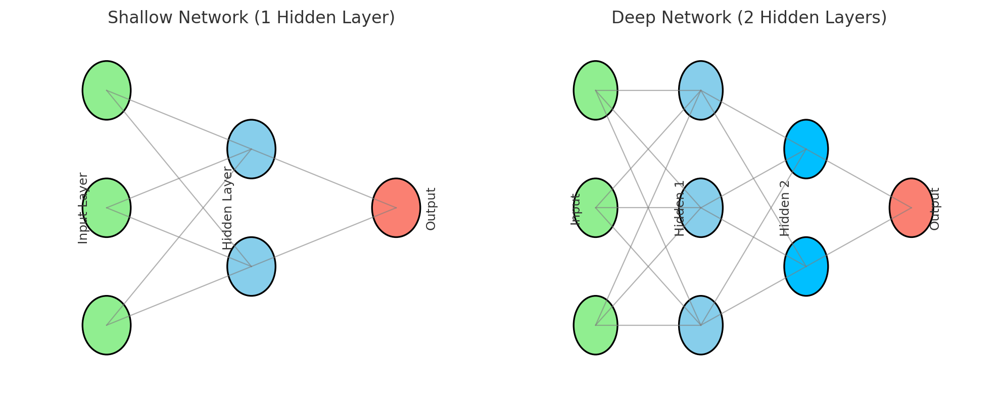
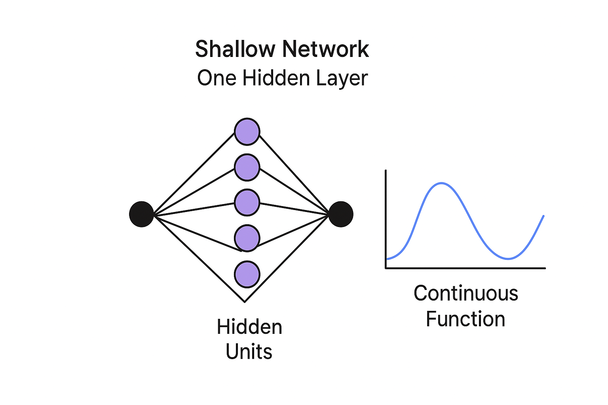

# 신경망 모델

## 목차

1. Shallow 네트워크

   1. 구조 및 활성화함수
   2. 조각별 선형(piecewise linear) 표현
   3. 표현력/보편적 근사 정리

2. Deep Network
   1. 네트워크 합성과 층별 출력, "접기(folding)" 직관
   2. Shallow vs Deep 비교
   3. 행렬.벡터 수식화와 도식

## 학습 목표

- 신경망이란 무엇인지를 알아보고, 기본 구성요소를 설명한다.
- Hidden unit 의 역할(비선형성 도입.특징 변환)을 이해한다.
- Shallow 네트워크와 Deep 네트워크의 차이(구조, 표현력, 효율성)를 구분한다.

# 1. Shallow 네트워크

1️⃣ 선형 회귀부터 다시 보기

선형회귀란 입력 하나에 대한 출력을 예측하는 모델이었다. 식으로 나타내면 다음과 같다.

$$ y=ϕ0​+ϕ1​x$$

2️⃣ 그런데 세상은 직선만으로는 안됨 !

"온도와 아이스크림 판매량"과 같은 경우 선형으로 표현이 될 수도 있지만, "시간과 행복도"와 같은 경우는 표현이 힘듦.

-> 선 몇 개를 꺾어서 부드럽게 잇는 모델이 필요함! 이를 **신경망(Neural Network)** 이라고 함.

3️⃣ Shallow 네트워크란?

- 얕은 네트워크는 은닉층이 딱 한 층 있는 모델.
- 즉, 입력 값을 한 번 비틀어서 더 다양한 모양의 결과를 만드는 계산기에 비유할 수 있다.

식으로 나타내면 다음과 같다.

$$
y=ϕ0​+ϕ1​a[θ10​+θ11​x]+ϕ2​a[θ20​+θ21​x]+ϕ3​a[θ30​+θ31​x]
$$

4️⃣ 활성화 함수(activation function)

## ReLU 함수

```math
a(z) =
\begin{cases}
0, & \text{if } z < 0 \\[6pt]
z, & \text{if } z \ge 0
\end{cases}
```

| 항목                         | 의미                                             | 역할 및 설명                                                                                                                                                                                     |
| :--------------------------- | :----------------------------------------------- | :----------------------------------------------------------------------------------------------------------------------------------------------------------------------------------------------- |
| **$y$**                      | **출력 (Output)**                                | 신경망 모델이 최종적으로 계산해 내는 값. 예측값이나 분류 결과 등이 될 수 있음.                                                                                                                   |
| **$x$**                      | **입력 (Input)**                                 | 모델에 주어지는 데이터. ex) 이미지의 픽셀 값, 주택의 면적 등.                                                                                                                                    |
| **$\phi$**                   | **매개변수 (Parameters)**                        | $\phi = \{ \phi_0, \phi_1, \phi_2, \phi_3, \theta_{10}, \theta_{11}, \theta_{20}, \theta_{21}, \theta_{30}, \theta_{31} \}$ 모델이 학습해야 할 **10개의 값들**. 이 값들이 모델의 '지식'을 형성함 |
| **$\phi_0$**                 | **편향 (Bias)**                                  | 전체 식에 더해지는 상수. 출력의 기준점을 조절                                                                                                                                                    |
| **$a[\dots]$**               | **활성화 함수 (Activation Function)**            | 신경망이 **비선형적인** 패턴을 학습할 수 있게 해주는 핵심 요소                                                                                                                                   |
| **$\theta_{i0}$**            | **은닉층의 편향 (Bias for hidden node $i$)**     | 활성화 함수 $a[\dots]$ 안에서 기준점을 조절                                                                                                                                                      |
| **$\theta_{i1}$**            | **은닉층의 가중치 (Weight for hidden node $i$)** | 입력 $x$의 **영향력**을 조절                                                                                                                                                                     |
| **$\phi_1, \phi_2, \phi_3$** | **출력 가중치 (Output Weights)**                 | 각 활성화 함수 $a[\dots]$의 결과가 최종 출력 $y$에 얼마나 기여할지를 조절하는 가중치                                                                                                             |

-> 음수는 0으로 자르고, 양수만 그대로 내보내기

- 모수가 정해지면 특정 함수가 결정됨
- 모수가 주어지면 추론(식을 계산, 예측)할 수 있음
- 훈련데이터가 주어지면 손실함수를 정의하고 손실을 최소화할 수 있도록 모수 조정

**용어 참조**

| 구분             | 이름    | 역할                           |
| ---------------- | ------- | ------------------------------ |
| 입력 (x)         | 데이터  | 모델이 받는 값                 |
| 모수 (parameter) | φ, θ 등 | 모델이 학습을 통해 조정하는 값 |
| 출력 (y)         | 결과    | 예측된 값                      |

## Neural Network 작동방식

- linear 식으로 표현 -> 활성화 함수 적용 -> 활성화 후 $\phi_j$ 배 적용 -> 세 함수의 합 구하기

-> hidden unit 의 개수만큼 꺾인 점이 생김

## 1-3. Shallow 네트워크의 표현력



- Shallow Network: hidden layer가 1개인 네트워크
- Deep Network: hidden layer 가 2개 이상인 네트워크

### 일반적인 D 개의 hidden units

$$
h_d = a[\theta_{d0} + \theta_{d1}x]
$$

### 최종 출력

$$
y = \phi_{0} + \sum_{d=1}^{D} \phi_{d} h_{d}
$$

### 보편적 근사 정리(Universal approximation theorem)



- Hidden unit 을 충분히 많이 갖는다면, 얕은 신경망은 임의의 연속함수를 임의의 정밀도로 근사할 수 있음

## 다중 출력
