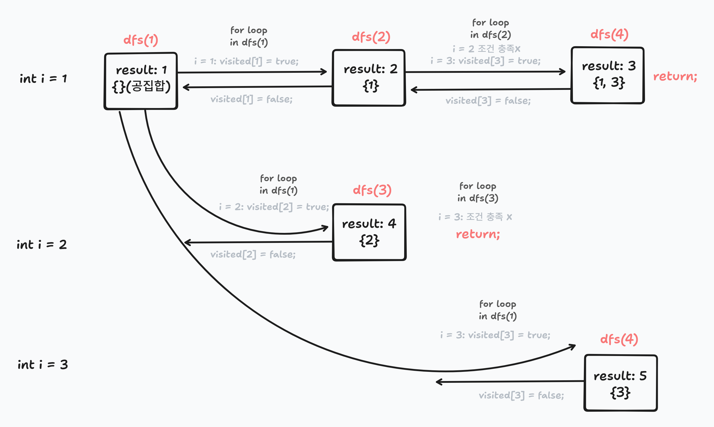

문제 이름 또는 번호: 3421 / 수제버거장인

코드(선택): cpp

오늘의 메모: 조합을 dfs 로 구현

처음에는 만들어질 수 있는 모든 경우의 수를 탐색하여 조합이 아닌 순열로 코드를 구현했다. 조합을 구현하고 싶었는데 실력미달로.. 그랬더니 시간초과가 났다 !!!

```cpp
void dfs(int idx) {
    for (int i = idx; i <= N; i++) {
        // 1. 선택
        // 2. 재귀
        // 3. 되돌리기
    }
}
```

이러한 공식을 숙지하자.

조합이므로 다음에 고를 수는 현재 수보다 무조건 큰 수다. 그래서 idx 를 시작점으로 주고, 그 다음부터 선택 가능한 수들을 하나씩 재귀적으로 탐색하는 구조이다.

전체적인 3421 번의 정답 코드의 흐름은 다음과 같다.



```cpp
#include <iostream>
#include <cstring>
using namespace std;

int n, m, result;
bool relation[21][21], visited[21];

void init() {
    result = 0;
    memset(relation, false, sizeof(relation));
    memset(visited, false, sizeof(visited));
}

bool checkRelationship(int idx) {
    for (int i = 1; i < idx; i++) {
        if (visited[i] && relation[i][idx]) {
            return false;
        }
    }
    return true;
}

void dfs(int idx) {
    result++;

    for (int i = idx; i <= n; i++) {
        if (!visited[i] && checkRelationship(i)) {
            visited[i] = true;
            dfs(i + 1);
            visited[i] = false;
        }
    }
}

int main() {
    int t, a, b;

    cin >> t;
    for (int tc = 1; tc <= t; tc++) {
        init();
        cin >> n >> m;
        for (int i = 0; i < m; i++) {
            cin >> a >> b;
            relation[a][b] = true;
            relation[b][a] = true;
        }
        dfs(1);
        cout << "#" << tc << " " << result << "\n";
    }
    return 0;
}
```
