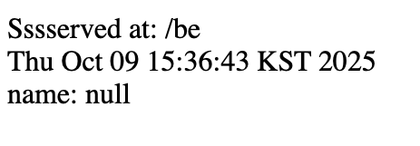

## 1. homebrew tomcat 서버와 intellij 톰캣 서버 충돌

자꾸 Homebrew 의 톰캣이 자동으로 실행되어서 결국 삭제하고 intellij 톰캣만 사용중이다.

## 2. HTML 줄바꿈 문제

```java
resp.setContentType("text/html;charset=utf-8");
resp.getWriter().append("Sssserved at: ").append(req.getContextPath()).append("\n").append(new Date().toString()).append("\n");
resp.getWriter().append("name: " + name);
```

위와 같이 append 안에 "\n" 을 넣어서 줄바꿈을 시도하였으나 화면에는 반영되지 않았다.

### 원인
```resp.setContentType("text/html;charset=utf-8");``` 라고 설정했기 때문에 브라우저는 이 내용을 HTML 문서로 인식한다. HTML 문서는 일반적인 줄바꿈 문자(\n)나 여러 개의 공백을 단순히 하나의 공백으로 처리하고 무시한다. 이것을 **Whitespace Collapse**라고 한다.

### 해결방법
HTML 태그 사용

```append("<br>")``` 로 바꿔준다.

### 결과



다음과 같이 줄바꿈이 잘된다.
