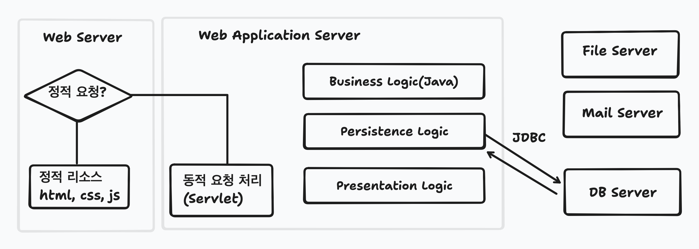
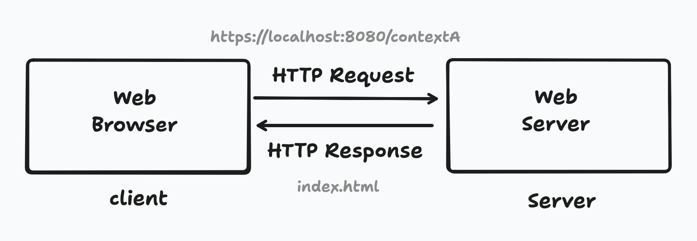
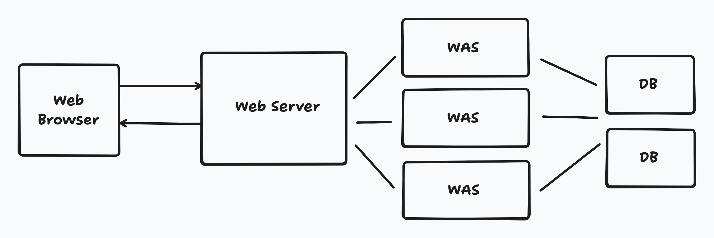
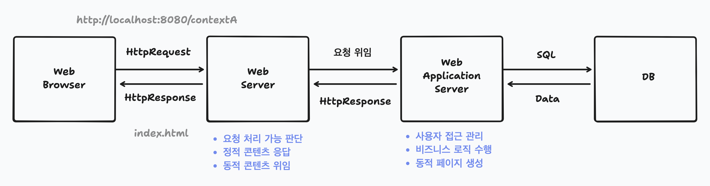
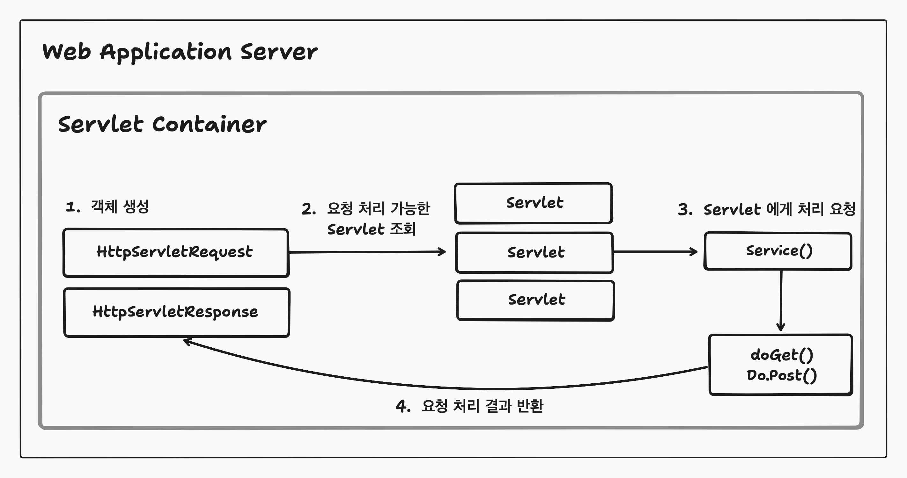

# Web Server & Web Application Server
---
# 1. 웹 프로그램



- 네트워크 너머의 서버에서 존재하며 웹을 통해서 서비스되는 프로그램

# 2. 웹 서버



- 웹 리소스를 요청받고 응답하는 역할
- 요청과 응답은 HTTP(클라이언트와 서버 간 요청과 응답을 위한 통신 프로토콜)를 통해 이루어짐
- HTML, CSS, JS 와 같은 정적 콘텐츠에 대한 응답 가능

> 정적 콘텐츠란? 
> - 사용자마다 변경될 필요가 없는 콘텐츠
>- 컴퓨터에 저장된 파일을 요청이 오면 그대로 반환
>- ex) JPG, GIF, HTML, CSS, JS

## 2-1. 작동 방식

- 정적 콘텐츠를 서버 내부에 저장하고, 파일 경로를 요청받으면 해당 경로에 있는 파일 반환

## 2-2. 역할

- ```정적 콘텐츠```: 직접 응답
- ```동적 콘텐츠```: WAS 로 요청 전달 및 처리된 결과를 받아 응답
- 로드밸런싱

### 2-2-1. 로드밸런싱 ?



- 연동된 WAS 가 두 개 이상일 경우 요청을 분산시켜 서버 부하를 방지하는 것

- 기본적으로는 모든 WAS 에게 요청을 균등하게 분배하지만, 특정 서버에 가중치를 두어 요청을 많이 분배하거나, 특정 서버를 백업 서버로 두어 모든 서버가 사용할 수 없게 되는 경우만 사용하게 할 수도 있음
- 연동된 서버들에 대한 지속적인 모니터링
	- 주기적으로 서버의 상태를 체크하는 요청을 보냄. 정상 응답이 오지 않거나 응답이 늦어질 경우 비정상 서버로 판단하여 로드밸런싱 대상에서 제외함
	- 비정상 서버로 판단되더라도 지속적인 모니터링을 통해 정상으로 판단될 경우 다시 로드밸런싱 대상에 포함

- 클라이언트는 웹서버와만 통신하기 때문에 WAS IP 노출 X
- WAS 의 프록시 설정을 통해 추가적인 보안 설정 가능
	- WAS 의 응답 헤더에서 민감한 정보나 불필요한 정보 제거 가능
	- 클라이언트의 요청 URL 을 다른 URL 로 변경 가능
- 동일한 요청이 반복될 때 응답에 캐싱된 데이터를 제공하는 프록시 캐시 기능도 제공

# 3. Web Application Server



- 클라이언트가 요청한 동적 콘텐츠를 생성하고 응답하는 역할
- DB 연동을 통해 애플리케이션의 핵심 비즈니스 로직 수행

- 대부분 WAS(ex) Tomcat) 는 웹서버와 서블릿 컨테이너를 결합한 형태로 정적 및 동적 콘텐츠 모두 응답 가능
	- 하지만 WAS 에 정적, 동적 콘텐츠에 대한 응답을 모두 맡기면 WAS 의 부담 증가
		- 로딩지연으로 인한 사용자 경험에 부정적인 영향
		- 서버 장애 시 오류 화면 노출 불가
		<br>
		-> Web Server, WAS 를 분리하여 WAS 의 부담 감소 및 효율적인 자원 관리를 하는 것이 효율적임

## 3-1. Servlet ?



- Java Web Application 개발 환경에서 클라이언트의 요청을 받아 처리하고 HTML, Json 과 같은 형식으로 데이터를 구성하고 동적 페이지를 만들어서 응답해주는 역할 수행

- ```Servlet Container```: Servlet 을 생성하고 관리하는 곳

### 3-1-1. 작동 방식

1. Servlet Request/Servlet Response 객체 생성
2. 설정 파일을 참고하여 매핑할 Servlet 을 확인
3. 해당 Servlet instance 존재 유무를 확인하여 없으면 생성(init())
4. Servlet Cotainer 에 thread 를 생성하고 res, req 를 인자로 service 실행
