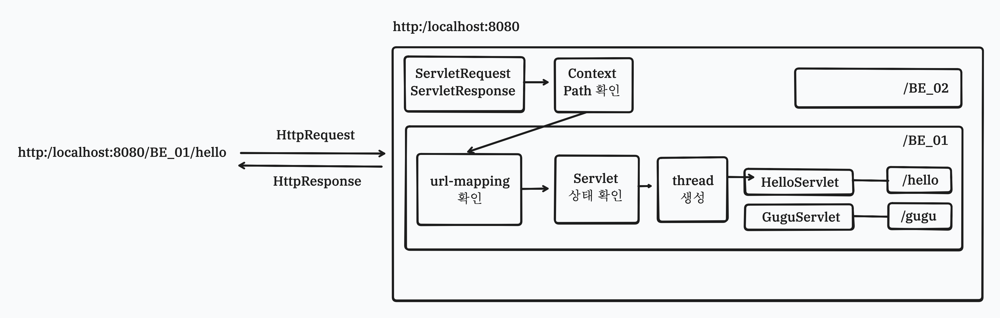
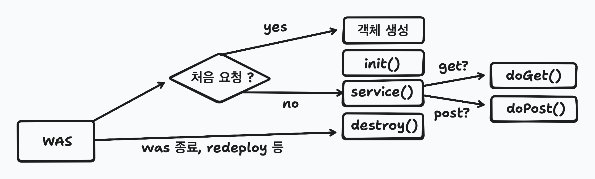
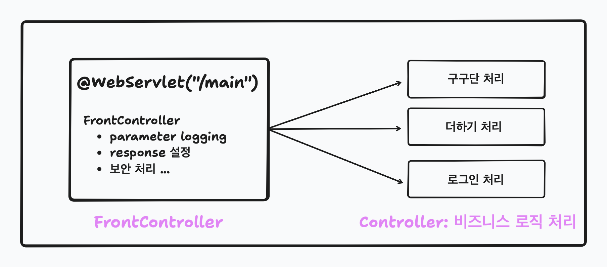
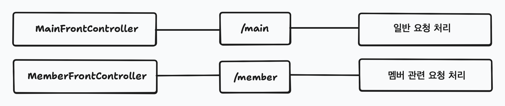
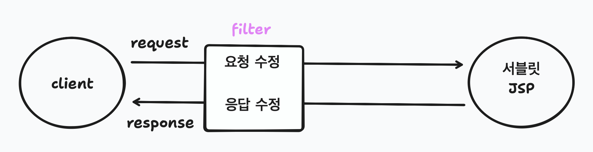
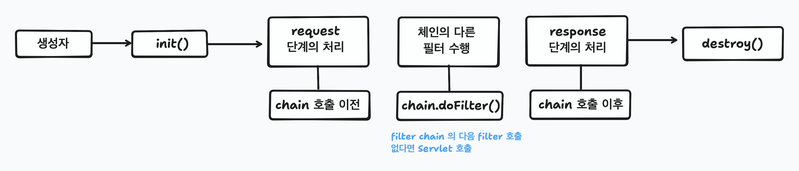

# 1. Servlet

- 클라이언트의 요청을 처리하고, 그 결과를 반환하는 Servlet 클래스의 구현 규칙을 지킨 자바 웹 프로그래밍 기술

## 1-1. 작동 과정



1. 클라이언트가 URL 을 입력하면 HttpRequest 가 Servlet Container 로 전송
2. 요청을 받은 Servlet Container 은 HttpServletRequest, HttpServletResponse 객체 생성
3. web.xml 을 기반으로 사용자가 요청한 URL 이 어느 서블릿에 대한 요청인지 찾음
4. 해당 서블릿에서 service 메소드를 호출한 후 클라이언트의 GET, POST 여부에 따라 doGet() 또는 doPost() 호출
5. doGet() 또는 doPost() 메소드는 동적 페이지를 생성한 후 HttpServletResponse 객체에 응답을 보냄
6. 응답이 끝나면 HttpServletRequest, HttpServletResponse 두 객체를 소멸 시킴

## 1-2. URL Mapping

- 클라이언트의 HTTP 요청을 Servlet 과 매핑하기 위한 방법
- ```@WebServlet``` 애너테이션을 활용하여 매핑 정보 등록

```java
@WebServlet(description = "Hello 라고 인사하는 Servlet", urlPatterns = {"/hello"}) // URL 매핑 설정
```

```java
@WebServlet("/hello")
```

## 1-3. Servlet Life Cycle

- Servlet 이 효율적인 자우너 관리와 최적화된 성능 구현을 할 수 있도록 함



- ```init()```: Servlet 에서 필요한 자원 초기화
	- 어떠한 요청도 init 이 종료되기 전에는 처리될 수 X

- ```service()```: 실제 비즈니스 로직
	- 요청 방식에 따라 ```doGet()```, ```doPost``` 호출

- ```destroy()```: init 에서 초기화한 자원의 정리
	- 어떠한 요청이라도 처리하고 있으면 동작 X

## 1-4. HttpServletRequest 와 HttpServletResponse

- 각각 Http의 request, response 를 추상화하기 위한 JEE 인터페이스

### 1-4-1. HttpServletRequest
- Http 요청을 추상화한 인터페이스로 헤더, 파라미터, 속성 및 요청 본문과 관련된 정보에 접근하는 메서드 제공

**Http Method**

| HTTP 메소드 | 요청에 Body 가 있음 | 응답에 Body 가 있음 | 안전 | 멱등 | 캐시 가능 |
| --- | --- | --- | --- | --- | --- |
| GET | optional | O | O | O | O |
| Post | O | O | X | X | O |

### 1-4-2. HttpServletResponse
- Http 응답을 추상화한 인터페이스로 헤더 조회/설정, 응답 상태, 응답 전송을 위한 작업 처리

**Content-type**
- ```text/plain```: 일반 텍스트로 형식이 없는 데이터
	- 일반 html 문서, 웹 페이지로 표시됨

- ```application/json```: JSON 형식의 데이터, REST API 응답에 사용
	- JPEG 형식의 이미지

**Character Encoding**
- 데이터를 컴퓨터가 이해하고 처리할 수 있는 형태로 변환하는 방법
- charset-UTF=8 로 해야 한글이 안깨짐

# 2. Servlet Container
- 서블릿을 관리해주는 컨테이너
- 클라이언트의 요청을 받아주고 응답할 수 있게, 웹 서버와 소켓으로 통신

## 2-1. 역할
- 웹 서버와의 통신 지원
	- 일반적으로는 소켓을 만들고 listen, accept 등을 해야하지만 이러한 기능을 API 로 제공하여 생략 가능

- 서블릿 생명주기 관리
	- 서블릿 클래스를 로딩하여 인스턴스화 -> 초기화 메소드 호출 -> 요청이 들어오면 적절한 서블릿 메소드 호출 -> 서블릿이 생명을 다 한 순간 garbage collection 진행

- 멀티스레드 지원 및 관리
	- 서블릿 컨테이너는 요청이 올 때마다 새로운 자바 thread 를 하나 생성하는데, http 서비스 메소드를 실행하고 나면 thread 는 자동으로 죽음. 이러한 다중 thread 를 생성 및 운영하여 thread 의 안정성 보장

- 선언적인 보안 관리
	- 서블릿 컨테이너를 사용하면 보안과 관련된 내용을 서블릿 또는 자바 클래스에 구현하지 않아도 됨
	- 일반적으로 보안 관리는 XML 배포 서술자에 기록하므로, 보안에 대해 수정할 일이 생겨도 자바 소스코드를 수정하여 다시 컴파일 하지 않아도 보안관리가 가능

# 3. Front Controller



- 전면에서 모든 요청을 받아들이는 Servlet

## 3-1. 장점

- 단일 진입점
	- 모든 요청을 front controller 에서 접수하므로 요청 처리의 일관성

- 공통 처리
	- 필요한 전/후 작업(인증, 권한 검사, 로깅 등)의 일괄 처리 가능

- 유연한 확장성
	- 새로운 요청 처리를 추가할 때 기존의 구조를 크게 변경하지 않고도 쉽게 확장 가능

- 코드 간결성
	- 여러 개의 servlet 을 만드는 번거로움이 줄고 코드의 가독성도 향상

## 3-2. 요청의 구분

- url 에 언제나 특정 작업을 의미하는 파라미터 추가
	- ```main?action=gugu&dan=3```
	- ```main?action=hello```

## 3-3. Front Controller 작성



# 4. Filter



## 4-1. 주요 용도

- 인증, 인가
	- 사용자가 특정 페이지에 접근하기 전 로그인 여부(인증), 권한 여부(인가)

- 로깅
	- 요청 및 응답 추적
	- 문제 해결 및 사용자의 행동 분석

- 보안
	- XSS 공격(크로스 사이트 스크립트 공격) 등을 방지하기 위한 입력 값 검증 등

## 4-2. Filter 작성
- servlet: filter 를 적용할 servlet 특정
- URL 패턴: url 기반으로 filter 적용 대상 설정
	- 경로 기반, 확장자 기반

## Select Dispatcher: filter 를 적용할 시점
- ```request```: 클라이언트 직접 요청인 경우 적용(기본 값)
- ```forward```: forward() 를 통해 이동하는 경우에 적용. client 요청을 간접적으로 받는 경우
- ```error```: 에러 페이지로 전달 시

## 4-3. 생명 주기




