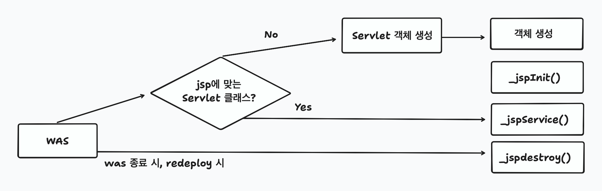

# 1. JSP

- stands for: Jakarta Server Pages
- HTML 태그 기반에 Java 코드를 작성하는 형태

## 1-1. 동작 원리
- JSP 는 중간단계이며, 최종은 Servlet 임
- ```*.jsp``` -> ```*_jsp.java``` -> ```*_jsp.class```

## 1-2 Life Cycle



## 1-3. Directive - JSP 지시자
- JSP 페이지가 실행될 때 필요한 정보를 지정하는 역할
	- 필요한 정보를 컨테이너에게 알려서 서블릿 생성에 활용

- ```<%@[directive] 속성="값" 속성="값" ... %>``` 의 형태

| directive | 설명 | 용도 |
| --- | --- | --- |
| page | - JSP 페이지에 대한 기본 정보 지정
- 문서의 타입, 출력 버퍼의 크기, 에러페이지 설정 등 | 모든 JSP 필수 |
| taglib | - JSP 페이지에서 사용할 태그 라이브러리 지정 | JSTL |
| include | - JSP 페이지의 특정 영역에 다른 문서 포함 | page 모듈화 및 재사용 |

| 속성 | 기본 값 | 설명 | 사용 예 |
| --- | --- | --- | --- |
| pageEncoding | UTF-8 | 페이지의 문자 인코딩 설정 | <%@ pageEncoding=”UTF-8”%> |
| contentType | text/html;charset=ISO8859-1 | 페이지의 MIME 타입 설정 | <%@ contentType=”text/html;charset=UTF-8” %> |
| import |  | 페이지에서 사용할 클래스의 패키지 | <%@ page import=”java.util.*” %> |

## 1-4. JSP 스크립트 요소

- script-let: ```<% [자바 실행문] %>```
	- _jspService 메서드 내부에 삽입됨 -> local 영역
	- local 영역에 선언된 JSP 내장 객체(HttpServletRequest, HttpServletResponse, JspWriter, ...) 를 자유롭게 사용

- declaration: ```<%! [멤버 변수 또는 메서드] %>```
	- 선언 위치에 상관 없이 멤버 변수, 메서드 선언

- expression: ```<%= [출력할 내용] %>```
	- ```<%=변수%>```, ```<%=리턴이 있는 메서드 호출%>```, ```<%=수식%>```
	- Servlet 에서 _jspService() 내부에서 out.println() 형태로 변형

- comment: ```<%-- [주석 내용] --%>```
	- JSP 에서만 존재하며 Servlet 에는 전달되지 않음
	- html 주석을 이용해서 민감한 내용이 화면에 전달되지 않도록 주의

## 1-5. 내장 객체

- .jsp 파일의 _jspService 메서드 내부에 로컬 변수로 이미 선언된 객체

| 내장 객체           | 클래스 (타입)              | 주요 역할                                   | 주요 메서드 예시                                                            | 비고                             |
| --------------- | --------------------- | --------------------------------------- | -------------------------------------------------------------------- | ------------------------------ |
| **request**     | `HttpServletRequest`  | 클라이언트의 요청 정보를 담고 있음 (요청 파라미터, 헤더, 쿠키 등) | `getParameter()`, `getAttribute()`, `setAttribute()`, `getSession()` | 요청 단위 (요청이 끝나면 소멸)             |
| **response**    | `HttpServletResponse` | 클라이언트에게 응답을 보낼 때 사용 (헤더, 쿠키, 리다이렉트 등)   | `sendRedirect()`, `addCookie()`, `setContentType()`                  | 응답 제어용                         |
| **out**         | `JspWriter`           | JSP 페이지에 출력할 때 사용 (HTML 텍스트 등)          | `print()`, `println()`, `flush()`, `clear()`                         | 출력 버퍼 제어 가능                    |
| **session**     | `HttpSession`         | 사용자별 세션 정보를 저장 (로그인 정보 등)               | `setAttribute()`, `getAttribute()`, `invalidate()`                   | 브라우저 단위 (세션 유지)                |
| **application** | `ServletContext`      | 웹 애플리케이션 전체에서 공유되는 정보 저장                | `setAttribute()`, `getAttribute()`, `getInitParameter()`             | 전역 스코프 (서버가 종료될 때까지 유지)        |
| **pageContext** | `PageContext`         | JSP 페이지의 모든 객체에 접근 가능 / 페이지 컨텍스트 관리     | `getRequest()`, `getResponse()`, `findAttribute()`, `include()`      | JSP에서만 존재                      |
| **exception**   | `Throwable`           | 예외 페이지(`errorPage`)에서 예외 정보를 담는 객체      | `getMessage()`, `printStackTrace()`                                  | `isErrorPage="true"`일 때만 사용 가능 |
| **config**      | `ServletConfig`       | JSP 초기화 설정 정보 제공 (web.xml의 설정 등)        | `getInitParameter()`, `getServletName()`, `getServletContext()`      | 서블릿 초기화 시점에 생성                 |

## 1-6. Web Scope

### 종류

| 객체                                   | 스코프                 | 생명주기         |
| ------------------------------------ | ------------------- | ------------ |
| **pageContext**, **out**, **config** | 페이지(page)           | JSP 페이지 처리 중 |
| **request**                          | 요청(request)         | 요청 처리 동안     |
| **session**                          | 세션(session)         | 브라우저 유지 동안   |
| **application**                      | 애플리케이션(application) | 서버 종료 시까지    |
| **exception**                        | 예외 페이지에서만           | 예외 발생 시      |

### 사용방법

| 메서드                                           | 반환 타입                 | 매개변수     | 역할                                 | 예시                                                                                                                                                                        | 비고                               |
| :-------------------------------------------- | :-------------------- | :------- | :--------------------------------- | :------------------------------------------------------------------------------------------------------------------------------------------------------------------------ | :------------------------------- |
| **`setAttribute(String name, Object value)`** | `void`                | 속성 이름, 값 | 해당 스코프에 데이터를 **저장**                | `request.setAttribute("user", "taeha");`                                                                                                                                  | 기존 이름이 있으면 덮어씀                   |
| **`getAttribute(String name)`**               | `Object`              | 속성 이름    | 해당 스코프에서 데이터를 **조회**               | `String user = (String)request.getAttribute("user");`                                                                                                                     | 없으면 `null` 반환                    |
| **`removeAttribute(String name)`**            | `void`                | 속성 이름    | 해당 스코프에서 데이터를 **삭제**               | `session.removeAttribute("user");`                                                                                                                                        | 삭제 후 `getAttribute()`는 `null` 반환 |
| **`getAttributeNames()`**                     | `Enumeration<String>` | (없음)     | 해당 스코프에 저장된 모든 속성 이름을 **열거형으로 반환** | <pre><code>Enumeration<String> names = request.getAttributeNames();<br>while(names.hasMoreElements()) {<br>    System.out.println(names.nextElement());<br>}</code></pre> | 속성 이름 전체 탐색 가능                   |
