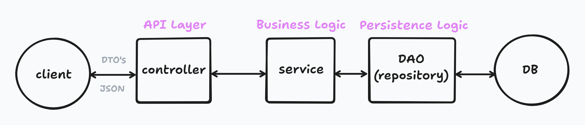

# 목차

1. 전체 그림 요약
   1. 클라이언트
   2. controller
   3. service
   4. DAO/Repository
   5. DB
2. DTO
   1. Request DTO
   2. Response DTO
3. Entity
4. 인증, 인가
   1. 인증
   2. 인가

# 💛 1. 전체 그림 요약

클라이언트 요청 -> 컨트롤러가 받음 -> 서비스가 처리 -> DB 에서 꺼내서 -> 다시 클라이언트로 보내줌

## 1-1. 클라이언트

- 요청하는 쪽

  - ex. 웹 브라우저, 모바일 앱, 프론트엔드(JS, React 등)

- 서버에 GET 또는 POST 요청
- 보통 요청/응답은 JSON 형식으로 주고받음

## 1-2. controller(API Layer)

- 클라이언트가 보낸 요청(JSON)을 받음
- 그 데이터를 DTO로 변환
- service 에 일을 시킴
- service 에서 처리된 결과를 다시 클라이언트에게 JSON 으로 돌려줌

### 예시

| 상자의 칸 (정보 이름) | 담는 내용 (데이터) | 설명        |
| :-------------------- | :----------------- | :---------- |
| **`name`** (이름)     | "김철수"           | 친구의 이름 |
| **`age`** (나이)      | "7"                | 친구의 나이 |
| **`nickname`** (별명) | "대장"             | 친구의 별명 |

## 1-3. service(Business Logic)

- 실제 로직을 처리하는 곳
- 필요한 데이터는 DAO(repository) 에 부탁해서 DB 에서 가져옴

## 1-4. DAO/Repository(Persistence Logic)

- DB 랑 직접 소통하는 곳
- SQL 을 날리거나, JPA 로 DB 데이터를 조회/저장
- ex. `findById(1)` -> DB 에서 id = 1 인 데이터를 찾아서 객체로 반환

## 1-5. DB(Database)

- MySQL, H2, PostgreSQL 같은 데이터베이스

## 정리

| 구분       | 역할                      | 예시                  |
| ---------- | ------------------------- | --------------------- |
| client     | 사용자 요청을 보냄        | “유저 정보 보여줘”    |
| controller | 요청 받기 & 응답 돌려주기 | `/api/users` 처리     |
| service    | 비즈니스 로직             | 유저 검증, 계산 등    |
| repository | DB 접근                   | SQL 실행, 데이터 조회 |
| DB         | 실제 데이터 저장          | users 테이블          |

# 2. DTO(Data Transfer AObject)

- 데이터 전송 객체(Data Transfer Object) 의 약자로, 여러 계층 간에 데이터를 주고받기 위해 사용되는 객체

## 종류

### 2-1. Request DTO

- 클라이언트가 서버에게 정보를 보낼 때 쓰는 상자

- 목적: 서버가 어떤 작업을 수행하기 위해 필요한 최소한의 데이터 전달

- 담는 내용: 클라이언트가 입력하거나 제공한 정보
  - ex. 회원가입: 아이디, 비밀번호, 이름
  - ex. 게시글 생성: 제목, 내용

### 2-2. Response DTO

- 서버가 작업을 마치고 클라이언트에게 결과를 돌려줄 때 쓰는 상자

- 목적: 클라이언트 화면에 보여주거나 다음에 사용할 데이터 제공

- 담는 내용: 화면에 필요한 정보, 서버가 추가한 정보

  - ex. 회원가입 결과: 새로 만들어진 회원의 고유 id, 이름, 가입 성공 메시지
  - ex. 게시글 조회: 게시글의 고유 id, 제목, 내용, 작성일자, 조회수

3. Entity

- 서버 내부에서 데이터를 관리하기 위한 핵심 객체

- 원본: DB 테이블 구조와 1:1 로 대응하며, 모든 원본 데이터를 담고 있음

-> 따라서, 서버는 entity 를 response DTO 로 변환하여 클라이언트에게 응답하는 것이 일반적인 원칙임

## 나눠서 쓰는 이유

| 구분             | Request DTO (요청)                            | Response DTO (응답)                              |
| :--------------- | :-------------------------------------------- | :----------------------------------------------- |
| **목적**         | 서버가 작업을 **수행**하기 위한 데이터 전달   | 클라이언트에게 **결과**나 **표시할 데이터** 제공 |
| **민감 정보**    | 비밀번호 등 **입력** 정보 포함                | 비밀번호, 내부 키 등 민감 정보 **제거**          |
| **DB 내부 정보** | 서버의 `ID`, `생성일` 등은 **없음**           | 서버가 생성한 `ID`, `작성일` 등 **포함**         |
| **유효성 검사**  | 데이터가 제대로 들어왔는지 **검증** 로직 필요 | 검증 로직 **불필요** (데이터를 주기만 함)        |
| **유지보수**     | 입력 데이터 구조가 바뀌면 수정                | 출력 데이터 구조가 바뀌면 수정                   |

# 4. 인증, 인가

## 4-1. 인증(Authentication)

- 사용자가 시스템에 자신이 누구인지 증명하는 과정

- ex. 웹사이트에 아이디와 비밀번호를 입력해서 로그인하는 것

- 주요 처리 위치: API 게이트웨이 또는 Controller 앞단(보안 필터/인터셉터)

## 4-2. 인가(Authorization)

- 인증된 사용자가 특정 자원에 접근하거나 사용할 권한이 있는지 확인하는 과정

- ex. 일반회원은 게시글만 읽을 수 있고, 관리자 설정 메뉴는 볼 수 없음

- 처리 위치가 다양함

  - Controller/API 단(간단한 권한 확인)

    - ex. 이메일 주소 확인, 관리자 여부 확인 등
    - @PreAuthorize("hasRole('ADMIN')") 와 같은 어노테이션을 Controller 메소드 위에 붙여서 관리자만 접근 가능하게 막는 경우

  - Service 단(비즈니스 로직 중심의 권한 확인)
    - ex. 게시글 Service.수정(게시글 Id, 사용자) 메소드 안에서 "만약 현재 사용자가 이 게시글의 작성자\_ID 와 일치하지 않으면 오류를 발생시켜라"와 같은 코드 작성

-> 정리: 두 과정 모두 시스템의 보안을 책임지지만, 인증은 입구에서 신원 확인을, 인가는 서비스 로직 내부에서 구체적인 권한 확인 담당
