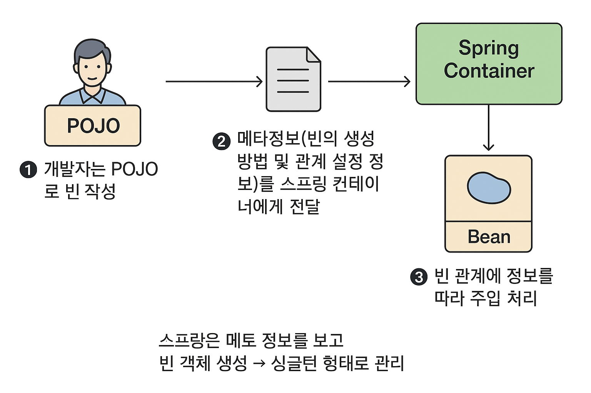

# 의존성 주입(DI) 학습 정리

## 📋 목차

1. [의존성과 DI란?](#1-의존성과-di란)
2. [DI의 필요성](#2-di의-필요성)
3. [Spring Framework의 역할](#3-spring-framework의-역할)
4. [명시적 DI - @Configuration과 @Bean](#4-명시적-di---configuration과-bean)
5. [Bean 생명주기](#5-bean-생명주기)
6. [묵시적 DI](#6-묵시적-di)
7. [스트레오타입 애너테이션](#7-스트레오타입-애너테이션)
8. [DI 방법의 비교](#8-di-방법의-비교)
9. [Appendix](#9-appendix)

---

## 1. 의존성과 DI란?

### 1.1 의존성(Dependency)의 개념

**의존성**이란?

- 어떤 객체(빈)가 비즈니스 로직 처리를 위해 다른 객체(빈)에 의존하는 관계
- 객체 간 **has-a 관계**
- 예시: "A는 B 없이 일을 못한다" = A는 B에 의존한다

### 1.2 의존성 주입(DI, Dependency Injection)

**DI란?**

- 객체의 의존성(멤버 변수 = 필요한 부품)을 **외부에서 주입**하는 것
- 의존 관계 관리를 위해 DI 개념을 사용하며, 이 과정에서 **제어의 역전(IoC)** 발생

**스프링 = IoC(Inversion Of Control) 컨테이너**

- 비유: **렌탈회사**
- 전통적으로는 의존성을 직접 구매했지만, 최근에는 렌탈 서비스가 급격히 증가!

### 1.3 스프링 빈(Spring Bean)

**스프링 빈이란?**

- 스프링 프레임워크에 의해 **생성되고 관리되는 자바 객체**
- 스프링은 빈의 생성, 의존관계 설정, 객체 관리 등 **빈의 라이프 사이클을 관리**
- **스프링 = 빈의 컨테이너**

**POJO(Plain Old Java Object)**

- 그냥 평범한 자바 객체
- Spring은 WasherUser, SWasher, LWasher 같은 객체를 빈으로 관리
- 특별한 제약 없이 일반적인 자바 객체로 만들면 됨

---

## 2. DI의 필요성

### 2.1 직접 생성 버전 (문제점)

**코드 구조**

```
┌────────────┐        ┌────────────┐
│ WasherUser │------> │   Swasher  │
└────────────┘        └────────────┘
        │
        │  has-a (직접 생성)
        ▼
의존성 강함 (강결합, Tight Coupling)
```

**코드 예시**

```java
public class WasherUser {
    Swasher washer; // has-a 관계: 의존성

    public WasherUser() {
        this.washer = new Swasher(); // 의존성을 직접 생성
    }

    public void useWasher(String clothes) {
        washer.wash(clothes);
    }
}

public class SWasher {
    public void wash(String clothes) {
        System.out.println("SWasher 로 세탁: " + clothes);
    }
}
```

**문제점**

- 세탁기를 SWasher에서 다른 것으로 바꾸려면 **유지보수가 어려움**
- 코드 수정이 필요함
- 강결합(Tight Coupling) 상태

### 2.2 Factory + 주입 버전 (해결책)

**코드 구조**

```
┌────────────┐        ┌────────────┐
│  WasherUser│------>│   Washer   │◄──────────────┐
└────────────┘        └────────────┘               │
        │                      ▲                   │
        │ (의존성 주입)         │ (상속/구현)        │
        ▼                     │                   │
    느슨한 결합               ┌───────────┐   ┌───────────┐
                             │  LWasher  │   │  Swasher  │
                             └───────────┘   └───────────┘
                                                   ▲
                                                   │
                                      ┌────────────┘
                                      │
                             ┌────────────────────┐
                             │   WasherFactory    │
                             │ createWasher(type) │
                             └────────────────────┘
```

**코드 예시**

```java
public class WasherUser {
    Washer washer; // has-a 관계 - 의존성

    // 의존성을 직접 생성하지 않고 외부에서 주입받음
    public WasherUser(Washer washer) {
        this.washer = washer;
    }
}

public class WasherFactory {
    public static Washer createWasher(String type) {
        return switch(type) {
            case "L" -> new LWasher();
            default -> new Swasher();
        };
    }
}
```

**장점**

- WasherFactory를 통해 세탁기를 얻어서 주입
- WasherUser는 더 이상 세탁기를 생성하지 않음
- 느슨한 결합(Loose Coupling) 상태

### 2.3 비교표

| 구분            | 직접 생성 버전                         | Factory + 주입 버전                                 |
| --------------- | -------------------------------------- | --------------------------------------------------- |
| **의존성 형태** | 강결합 (Tight Coupling)                | 느슨한 결합 (Loose Coupling)                        |
| **특징**        | 클래스 간 변경이 어렵고, 유지보수 힘듦 | Washer 종류가 바뀌어도 User 코드는 그대로 유지 가능 |
| **비유**        | 내가 직접 세탁기 삼                    | 공장에서 받아씀                                     |
| **코드 관계**   | `new Swasher()`                        | `WasherUser(Washer washer)`                         |
| **결과**        | 세탁기 바꾸려면 코드 고쳐야 함 😭      | 세탁기 바뀌어도 난 그대로 😎                        |

---

## 3. Spring Framework의 역할

### 3.1 Spring의 등장

**Spring의 역할**

- WasherUser, SWasher, LWasher 같은 객체를 **빈이라는 개념으로 관리**
- 설정에 따라 WasherUser의 의존성인 Washer에 가지고 있는 빈(SWasher, LWasher 중 하나)을 **자동으로 주입**

### 3.2 Spring의 빈 관리 과정



**3단계 프로세스**

1. **개발자는 POJO로 빈 작성**

   - 일반적인 자바 객체로 작성

2. **메타정보 전달**

   - 빈의 생성 방법 및 관계 설정 정보를 스프링 컨테이너에게 전달

3. **런타임 처리**
   - 스프링은 메타 정보를 보고 빈 객체 생성 → **싱글턴 형태로 관리**
   - 빈 관계 정보에 따라 **주입 처리**

### 3.3 DI 방법

객체의 의존성을 주입하는 방법:

1. **직접 field에 할당하는 방법**
2. **생성자를 활용하는 방법** (권장)
3. **setter 메서드를 이용하는 방법**

---

## 4. 명시적 DI - @Configuration과 @Bean

### 4.1 명시적 DI란?

**정의**

- 빈을 생성하고 의존성을 주입하는 코드를 **별도의 파일에 명시**
- 설정 클래스를 통해 빈을 직접 정의

### 4.2 @Configuration

**역할**

- "이 클래스는 설정을 담고 있는 곳이야!" 라는 표시
- 클래스 안에서 어떤 빈을 만들지 정리하는 역할
- Java 기반으로 설정 파일을 만들기 위한 annotation
- **클래스 레벨에 선언**

```java
@Configuration
public class WasherConfig {
    // 빈 정의 메서드들...
}
```

### 4.3 @Bean

**역할**

- 빈을 선언하기 위한 annotation
- **메서드 레벨에 선언**
- **메서드의 이름 = 빈의 이름**

**특징**

- `@Bean`의 `value` 또는 `name` 속성으로 빈 이름 지정 가능
- `autowireCandidate` 속성으로 자동 주입 여부 지정 가능
- 메서드 이름을 지정하지 않으면, 메서드 이름이 빈 이름이 됨

### 4.4 예시 코드

**WasherConfig.java**

```java
@Configuration
public class WasherConfig {

    @Bean
    public SWasher sWasher() {
        return new SWasher();
    }

    @Bean
    public LWasher lWasher() {
        return new LWasher();
    }

    @Bean
    public WasherUser washerUser() {
        // 생성자를 통한 빈 주입
        return new WasherUser(sWasher());
    }
}
```

**설명**

- `sWasher()`: SWasher 타입의 빈 생성
- `lWasher()`: LWasher 타입의 빈 생성
- `washerUser()`: WasherUser 타입의 빈 생성, 생성자에 `sWasher()` 주입

### 4.5 사용 예시

**WasherTest.java**

```java
public class WasherTest {
    public static void main(String[] args) {
        // 스프링의 IoC 컨테이너(빈을 관리하는 통) 생성
        ApplicationContext ctx = new AnnotationConfigApplicationContext(WasherConfig.class);

        // 컨테이너에서 빈 꺼내기
        Washer washer = ctx.getBean(SWasher.class);
        WasherUser user = ctx.getBean(WasherUser.class);

        // 빈 사용
        user.useWasher();

        // 같은 객체인지 확인 (싱글턴)
        System.out.println(user.getWasher() == washer);
    }
}
```

**실행 흐름**

1. `ApplicationContext` 생성 → `WasherConfig` 읽기
2. `WasherConfig`의 `@Bean` 메서드들 실행
3. 빈들이 컨테이너에 등록됨
4. `getBean()`으로 빈 꺼내서 사용

---

## 5. Bean 생명주기

### 5.1 Bean 생명주기 7단계


**순서**

1. **스프링 IoC 컨테이너 생성**
2. **스프링 빈 생성**
3. **의존관계 주입**
4. **초기화 콜백 메소드 호출** (`@PostConstruct`, `afterPropertiesSet()`)
5. **사용**
6. **소멸 전 콜백 메소드 호출** (`@PreDestroy`, `destroy()`)
7. **스프링 종료**

**핵심**

- 스프링 컨테이너가 빈의 전체 생명주기를 관리
- 각 단계마다 콜백 메서드로 커스터마이징 가능
- 자동으로 정리 작업 수행

### 5.2 초기화 및 소멸 메서드

**요약**

- 컨테이너 생성 → 빈 생성 → 의존성 주입 → 초기화 → 사용(ctx.getBean(..)) → 소멸 → 종료
- 스프링이 전체 생명주기 관리

**초기화/소멸 메서드 비교표**

| 구분          | 초기화 메서드 (Initialization Method)                                                        | 소멸 메서드 (Destroy Method)                                                                 |
| :------------ | :------------------------------------------------------------------------------------------- | :------------------------------------------------------------------------------------------- |
| **주요 용도** | 빈에서 사용하려는 **자원의 초기화**.                                                         | 빈에서 사용한 **자원의 정리**.                                                               |
| **호출 시점** | 의존성 주입 후 **비즈니스 로직이 호출되기 전**.                                              | **모든 비즈니스 로직이 종료된 후**.                                                          |
| **작성 방법** | **묵시적 빈 등록**: `@PostConstruct` 적용<br>**명시적 빈 등록**: `@Bean`의 `initMethod` 속성 | **묵시적 빈 등록**: `@PreDestroy` 적용<br>**명시적 빈 등록**: `@Bean`의 `destroyMethod` 속성 |
| **주의 사항** | 메서드는 **파라미터가 없어야** 한다.                                                         | 메서드는 **파라미터가 없어야** 한다.                                                         |

**참고사항**

- `@PostConstruct`, `@PreDestroy` 사용을 위해서는 `jakarta.annotation-api` 필요

### 5.3 예시 코드

#### 묵시적 빈 등록

```java
@Component
@Scope

public class Bag {
    //...
    @PostConstruct
    public void setup() {
        System.out.println("캐리어 청소 !");
    }

    @PreDestroy
    public void destroy() {
        System.out.println("제자리로 !");
    }
}
```

#### 명시적 빈 등록

```java
@Bean(initMethod = "setup", destroyMethod = "destroy")
public SWasher sWasher() {
    return new SWasher();
}
```

---

## 6. 묵시적 DI

### 6.1 묵시적 DI란?

**정의**

- 명시적 DI처럼 `@Configuration`에서 `@Bean`을 사용하지 않는 형태
- `@Component`와 `@Autowired`를 사용하여 자동으로 빈을 등록하고 주입

### 6.2 @Component

- 빈으로 사용할 각각의 클래스들에 @Component 표시

```java
@Target(ElementType.TYPE)
public @interface Component {
    String value() default ""; // 생성되는 빈의 이름을 재정의 하려는 경우 사용
}
```

- 기본 빈의 이름
  - 클래스 이름이 Pascal case 인 경우는 첫 글자를 소문자로 한 camel case, 그렇지 않은 경우 클래스 이름 그대로 사용

```plain text
ex1. IronMan -> ironMan
ex2. SWasher ->SWasher
```

- @Component 의 value 속성으로 재정의 가능

### 6.3 @Autowired

- 빈을 주입하기 위해 사용되는 어노테이션
- 타입(클래스 종류)기반 주입. 타입을 보고 알아서 해당 타입의 빈을 컨테이너에서 찾음.
- 같은 타입이 두 개라면 `@Qualifer` 을 통해 이름으로 알려줌
- 생성자와 메서드에서 사용 시 대상 파라미터는 모두 Spring Bean 또는 @Value 에 의한 scalar 값

**Bean 주입과 Scalar 값 주입**

| 구분               | 예시                                  | 설명                              |
| ------------------ | ------------------------------------- | --------------------------------- |
| **Bean 주입**      | `@Autowired IronMan ironMan;`         | 스프링이 만든 객체를 넣어줌       |
| **Scalar 값 주입** | `@Value("${hero.name}") String name;` | 단순한 값(문자, 숫자 등)을 넣어줌 |

- `required = true`: 기본값이 true 라 꼭 있어야 하는 것
- `required = false`: 없으면 null 로 둠
- 한 클래스에 `@Autowired` 에 적용된 생성자는 최대 하나만 가능하며 메서드는 여러 번 사용 가능
- 생성자가 1개일 경우에 `@Autowired` 생략 가능
- 메서드에서는 여러번 쓸 수 있음

**붙일 수 있는 곳**

| 붙이는 위치 | 예시                                                 | 설명                      |
| ----------- | ---------------------------------------------------- | ------------------------- |
| **필드**    | `@Autowired private IronMan ironMan;`                | 바로 변수에 꽂음          |
| **생성자**  | `@Autowired public HeroUser(IronMan ironMan)`        | 객체 만들 때 같이 꽂음    |
| **메서드**  | `@Autowired public void setIronMan(IronMan ironMan)` | Setter 같은 메서드로 꽂음 |

**예시**

만약, 주인공 장난감이 HeroUser 이고, 도와주는 대박 짱 쎈 인형이 IronMan 이라고 가정하자.
HeroUser 은 IronMan 없이는 악당을 무찌르지 못한다 !
그래서 스프링이 자동으로 IronMan 인형을 찾아서 꽂아줘야 한다고 생각해보자.

- IronMan 역할: 공격
- HeroUser 역할: IronMan 이용해서 싸우기

1. IronMan 등록

```java
import org.springframework.stereotype.Component;

@Component
public class IronMan {
    public void attack() {
        System.out.println("리펄서 빔~~🔫");
    }
}
```

```java
import org.springframework.beans.factory.annotation.Autowired;
import org.springframework.stereotype.Component;

@Component
public class HeroUser {
    private final IronMan ironMan;

    @Autowired  // 스프링아, IronMan 좀 넣어줘~
    // 생성자가 1개이면 Autowired 어노테이션 안써도 됨
    public HeroUser(IronMan ironMan) {
        this.ironMan = ironMan;
    }

    public void fight() {
        ironMan.attack();
    }
}
```

되게 객체지향적이라는 생각이 들어서 객체지향적인 이유를 생각해보았다.

| OOP 원칙                 | 이 코드에서의 적용                                                   |
| ------------------------ | -------------------------------------------------------------------- |
| **단일 책임 원칙 (SRP)** | IronMan은 공격만, HeroUser는 IronMan을 사용하는 역할만               |
| **의존 역전 원칙 (DIP)** | HeroUser는 구체적인 IronMan이 아니라, “공격할 수 있는 존재”에 의존함 |
| **개방-폐쇄 원칙 (OCP)** | IronMan 대신 Hulk, Thor로 바꿔도 HeroUser는 수정할 필요 없음         |
| **캡슐화**               | HeroUser는 IronMan 내부 구현을 몰라도 됨 (attack()만 알면 됨)        |

### 6.4 @ComponentScan

**역할**

- `@Component`는 단지 "빈이 될 수 있다"는 의도로 실제 빈을 만들지는 않음
- `@ComponentScan`을 통해 대상 빈을 scan해야 빈으로 등록됨
- `@Configuration`이 사용된 클래스에 사용

**주요 속성**

- `basePackages`: component를 어디서 스캔할 것인가에 대한 정보
  - 생략 시 현재 애너테이션이 사용된 클래스의 모든 하위 패키지 스캔

```java
@Target(ElementType.TYPE)
public @interface ComponentScan {

    @AliasFor("basePackages") // 별명 붙이기
    String[] value() default {}; // value라는 속성을 선언. 기본값은 빈 배열.

    @AliasFor("value")
    // @Component 를 찾아볼 package 등록 - 하위패키지 모두 scan
    String[] basePackages() default {}; // basePackages() 가 value 의 별명임
}

```

---

## 7. 스트레오타입 애너테이션

### 7.1 @Component

- 특별한 의미를 가지지 않은 단순히 '빈의 대상'임을 나타내는 애너테이션
- 스트레오타입
  - 용도에 따라 미리 여러 형태로 정형화 해놓은 타입
  - 내부적으로 @Component 를 포함

| annotation         | 설명                                                    |
| :----------------- | :------------------------------------------------------ |
| **@Repository**    | MVC에서 Model의 Repository(DAO) 계열 빈에 사용          |
| **@Service**       | MVC에서 Model의 Service 계열의 빈에 사용                |
| **@Controller**    | MVC에서 controller로 사용되는 빈에 사용                 |
| **@Configuration** | java 기반의 메타정보 클래스에 사용                      |
| **@Component**     | 다른 스테레오 타입 애너테이션에 해당되지 않을 경우 사용 |

---

## 8. DI 방법의 비교

### 8.1 주입 방식 비교

#### 생성자 주입

- 가장 권장되는 방식
- 일반적으로 field 를 blank final 로 선언하고 생성자 주입을 사용 -> 빈의 불변성 확보

```java
@Component
public class A {
    private final B b;
    public A(B b) {this.b = b;}
}
```

```java
@Component
@RequiredArgsConstructor
public class B {
    private final A a;
    // public B(A a) {this.a = a;}
}
```

- 혹시나 발생할 수 있는 빈의 순환 의존성 문제를 빈 생성 시점에 즉시 발견 가능

#### Setter 주입

- 선택적인 의존성을 가진 빈의 주입에 적합

#### Field 주입

- 비추
- 코드가 가장 간결하지는 하지만 테스트 시 Mock 객체를 주입하기가 어렵고 빈의 불변성을 보장하기 힘듦
- 단위테스트처럼 특별한 목적을 위해 작성될 경우에만 사용 권장

### 8.2 설정 방식에 따른 DI 방법의 비교

| 구분                              | 명시적 DI (Explicit DI)                                                        | 묵시적 DI (Implicit DI)                                                                                       |
| :-------------------------------- | :----------------------------------------------------------------------------- | :------------------------------------------------------------------------------------------------------------ |
| **관심사 분리**                   | 비즈니스 로직과 빈 관리 로직의 분리 가능<br>- 의존성 주입 코드가 명확하게 보임 | 비즈니스 로직과 빈 관리 로직의 결합<br>- 전체적인 빈의 구조를 파악하기 어려움<br>- 하지만 개발 툴이 잘 지원함 |
| **설정 작성**                     | 빈 설정 코드가 별도로 관리되어야 함<br>- 의존성 주입 코드가 복잡해질 수 있음   | 개발자가 의존성 주입 코드를 작성하지 않아도 됨                                                                |
| **외부 라이브러리를 빈으로 활용** | 가능                                                                           | 제한적                                                                                                        |

-> 묵시적 DI 를 기본으로 하고 명시적 DI 를 보조적인 방식으로 사용

---

## 9. Appendix

### 9.1 @Bean 메서드의 파라미터 자동 주입

**특징**

- `@Bean`에서 메서드의 파라미터는 자동으로 `@Autowired` 대체

```java
@Bean(name = "myWasherUser")
public WasherUser washerUser() {
    WasherUser washerUser = new WasherUser();
    washerUser.setWasher(sWasher());
    return washerUser;
}
```

```java
@Bean(name = "myWasherUser")
public WasherUser washerUser(SWasher washer) {
    WasherUser washerUser = new WasherUser();
    washerUser.setWasher(washer);
    return washerUser;
}
```

### 9.2 @Value

**역할**

- 객체가 아닌 스칼라 값(문자열, 숫자 등)을 주입 받는데 사용

```java
@Target({ElementType.FIELD, ElementType.METHOD, ElementType.PARAMETER, ElementType.ANNOTATION_TYPE})
public @interface Value {
    String value();
}
```

- 주로 설정 파일에 선언된 property 를 참조하는 경우 사용: ${} 내부에 property 이름 등록

```java
@Value("${java.specification.version}")
int javaVersion;
```

---

## 📌 핵심 정리

### 의존성과 DI

- **의존성**: 객체 간 has-a 관계, "A는 B 없이 일을 못한다"
- **DI (Dependency Injection)**: 의존성을 외부에서 주입
- **IoC (Inversion of Control)**: 제어의 역전, 스프링이 객체 생명주기 관리
- **스프링 빈**: 스프링 프레임워크에 의해 생성되고 관리되는 자바 객체
- **POJO**: 평범한 자바 객체, 특별한 제약 없이 일반적인 자바 객체로 작성

### DI의 필요성

- **강결합 (Tight Coupling)**: 직접 생성(`new`) → 유지보수 어려움, 코드 수정 필요
- **느슨한 결합 (Loose Coupling)**: 주입 받기 → 유지보수 용이, 코드 변경 최소화

### 명시적 DI

- **@Configuration**: 설정 클래스 표시, Java 기반 설정 파일
- **@Bean**: 빈 정의 메서드, 메서드 이름 = 빈 이름
- 생성자 주입을 통한 의존성 주입
- `ApplicationContext`를 통해 빈 관리

### Bean 생명주기

- **7단계**: 컨테이너 생성 → 빈 생성 → 의존관계 주입 → 초기화 콜백 → 사용 → 소멸 콜백 → 종료
- **초기화**: `@PostConstruct` (묵시적) 또는 `@Bean(initMethod)` (명시적)
- **소멸**: `@PreDestroy` (묵시적) 또는 `@Bean(destroyMethod)` (명시적)

### 묵시적 DI

- **@Component**: 빈으로 사용할 클래스에 표시
  - 기본 빈 이름: Pascal case → camel case (IronMan → ironMan)
  - `value` 속성으로 재정의 가능
- **@Autowired**: 빈 주입 어노테이션
  - 타입 기반 주입, 같은 타입이 여러 개면 `@Qualifier` 사용
  - 필드, 생성자, 메서드에 사용 가능
  - 생성자 1개일 경우 생략 가능
- **@ComponentScan**: `@Component`를 스캔하여 빈으로 등록
  - `basePackages`로 스캔 범위 지정

### 스트레오타입 애너테이션

- **@Repository**: Repository(DAO) 계열 빈
- **@Service**: Service 계열 빈
- **@Controller**: Controller 계열 빈
- **@Configuration**: Java 기반 메타정보 클래스
- **@Component**: 위에 해당하지 않는 경우

### DI 주입 방식 비교

- **생성자 주입** (권장): 불변성 확보, 순환 의존성 조기 발견
- **Setter 주입**: 선택적 의존성에 적합
- **Field 주입**: 비추천, 테스트 어려움, 불변성 보장 힘듦

### 명시적 DI vs 묵시적 DI

- **명시적 DI**: 관심사 분리 가능, 외부 라이브러리 활용 가능, 설정 코드 복잡
- **묵시적 DI**: 개발 편의성, 코드 간결, 전체 구조 파악 어려움
- **권장**: 묵시적 DI를 기본으로, 명시적 DI를 보조적으로 사용

---

## 📚 이 자료를 참고하시오 ..

- 프로젝트: `backend/DI/FW_02/`
- 주요 파일:
  - **Washer 패키지**:
    - `com.study.live.washer.bean/Washer.java` (Interface)
    - `com.study.live.washer.bean/SWasher.java` (implements Washer)
    - `com.study.live.washer.bean/LWasher.java` (implements Washer)
    - `com.study.live.washer.bean/WasherUser.java`
    - `com.study.live.washer.config/WasherConfig.java` (설정 클래스)
    - `com.study.live.washer/WasherTest.java` (테스트 파일)
  - **Accessory 패키지**:
    - `com.study.live.accessory.bean/Bag.java`
    - `com.study.live.accessory.bean/Hat.java`
    - `com.study.live.accessory.bean/SmartWatch.java`
    - `com.study.live.accessory.bean/Watch.java`
    - `com.study.live.accessory.config/BagConfig.java`
