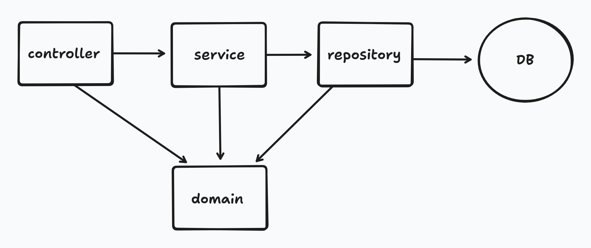
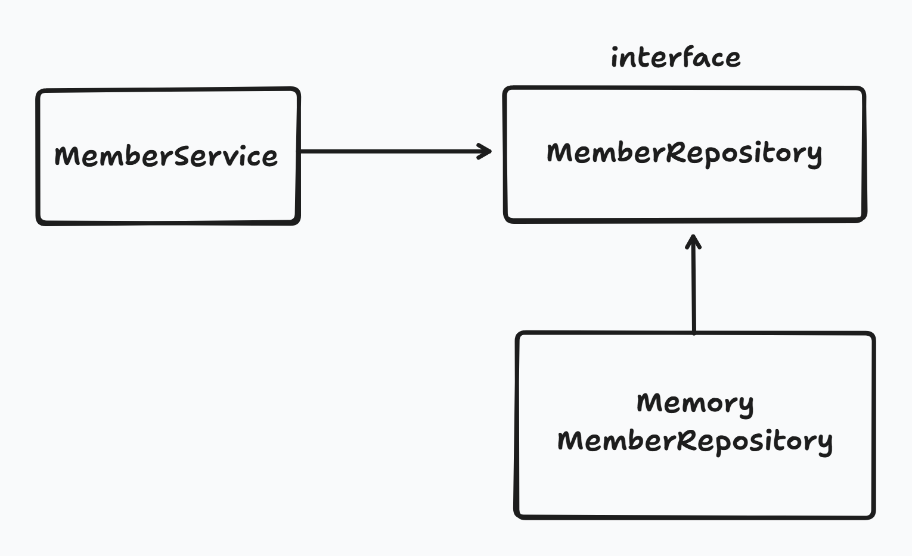

# 회원 관리 예제 - 백엔드 개발

# 목차

1. 비즈니스 요구사항 정리
2. 회원 도메인과 리포지토리 만들기
3. 회원 리포지토리 테스트케이스 작성
4. 회원 서비스 개발
5. 회원 서비스 테스트

# 1. 비즈니스 요구사항 정리

**일반적인 웹 애플리케이션 계층 구조**

- 컨트롤러: 웹 MVC 의 컨트롤러 역할
- 서비스: 핵심 비즈니스 로직 구현
- 리포지토리: 데이터베이스에 접근, 도메인 객체를 DB 에 저장하고 관리
- 도메인: 비즈니스 도메인 객체
  - ex) 회원, 주문, 쿠폰 등등 주로 데이터베이스에 저장하고 관리됨

**클래스 의존관계**

