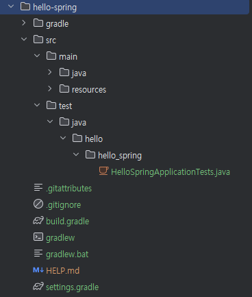

# 프로젝트 환경설정

## 목차

1. 프로젝트 생성
   - maven, gradle

# 1. 프로젝트 생성


## maven, gradle

- 프로젝트 관리 도구
- 필요한 라이브러리를 땡겨 오고, 빌드하는 라이프사이클까지 관리해주는 툴

🤷‍♀️: MakeFile 과 비슷한건가?

-> 비슷한 빌드 도구 이지만, 훨씬 더 강력하고 자동화된 기능을 가지고 있다.

### 공통점

| 구분               | Maven / Gradle                                                   | Makefile                                |
| ------------------ | ---------------------------------------------------------------- | --------------------------------------- |
| **역할**           | 코드 컴파일, 테스트, 패키징(JAR/WAR), 실행 등 자동화             | 코드 컴파일, 링크, 실행 자동화          |
| **명령 기반 빌드** | `mvn clean install`, `gradle build`                              | `make all`, `make clean`                |
| **의존성 관리**    | 자동으로 외부 라이브러리 다운로드                                | 수동으로 헤더·라이브러리 경로 설정 필요 |
| **빌드 스크립트**  | XML (Maven의 `pom.xml`), Groovy/Kotlin (Gradle의 `build.gradle`) | make 문법 기반의 `Makefile`             |

> JAR: 자바 프로그램을 하나의 파일로 묶은 압축 패키지 \
> WAR: 웹 애플리케이션을 묶은 배포용 패키지

### 차이점

| 항목                    | Maven / Gradle                                   | Makefile                         |
| ----------------------- | ------------------------------------------------ | -------------------------------- |
| **언어/환경 특화 정도** | Java, Kotlin, Scala 등 JVM 언어용                | C, C++, Fortran 등 범용          |
| **의존성 관리**         | Maven Central 같은 **원격 저장소**에서 자동 관리 | 직접 소스나 라이브러리 설치 필요 |
| **빌드 구조**           | 프로젝트 구조(예: `src/main/java`) 표준화        | 자유로운 구조, 직접 경로 지정    |
| **확장성**              | 플러그인으로 테스트, 배포, 문서화 자동화 가능    | 단순 빌드/링크 수준 중심         |

> Maven Central: 전 세계적으로 사용되는 공식 자바 라이브러리 저장소 \
> ex. 외부 라이브러리(Gson, Spring, JUnit 등)를 쓰고 싶을 때 직접 다운로드하지 않아도 `pom.xml` 이나 `build.gralde` 에 한 줄만 추가하면 Maven Central 에서 자동으로 받아옴

-> 요즘 추세는 gradle 로 넘어온 상태 !

## 기본 파일구조



src 는 main 과 test 가 나누어져있는 것이 일반적이다.

-> 테스트코드가 정말 중요하다 !

- `java`: 실제 자바 코드파일
- `resources`: 실제 자바 코드 파일을 제외한 xml, properties, 설정파일, html 등을 포함
- `build.gradle`: 버전 설정, 라이브러리 땡겨오기 등의 역할

# 2. View 환경설정

## Welcome Page


**공식문서 참고하기**

> Spring Boot supports both static and templated welcome pages. It first looks for an `index.html` file in the configured static content locations. If one is not found, it then looks for an `index` template. If either is found, it is automatically used as the welcome page of the application.

-> 스프링 부트는 `localhost:8080` 으로 접속했을 때 제일 처음 뜨는 페이지를 알아서 설정해줌

1. 먼저 index.html 파일이 static(ex. `resources/static`) 폴더 안에 있는지 봄
2. 거기 없으면 템플릿 폴더(ex. `resources/template`) 안에서 index(ex. `index.mustache`, `index.thymeleaf`) 라는 템플릿 파일을 찾음
3. 둘 중 하나라도 찾으면 자동으로 웹 앱의 첫 화면으로 보여줌

## 템플릿 엔진

- HTML 안에 자바 코드를 섞어서 동적으로 웹페이지를 만드는 도구

**Thymeleaf 예시**

```html
<h1>Hello, [[${name}]]!</h1>
<p>오늘은 [[${day}]]이에요.</p>
```
